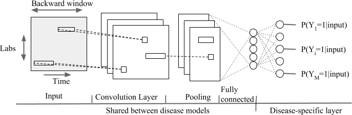
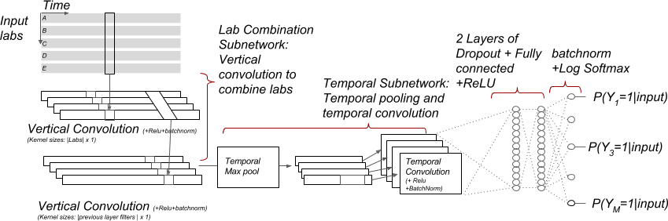
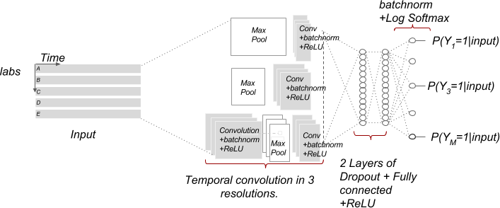
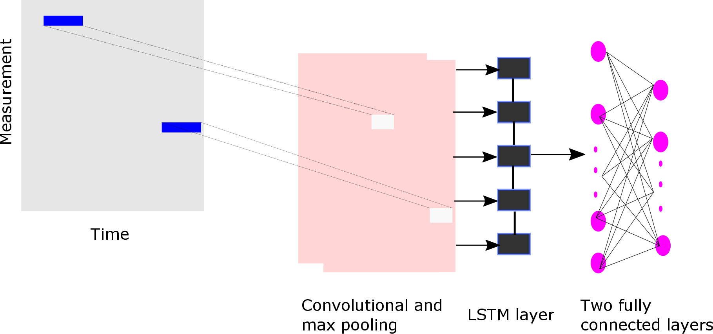
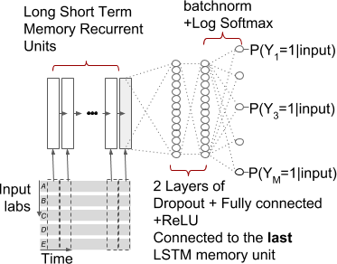
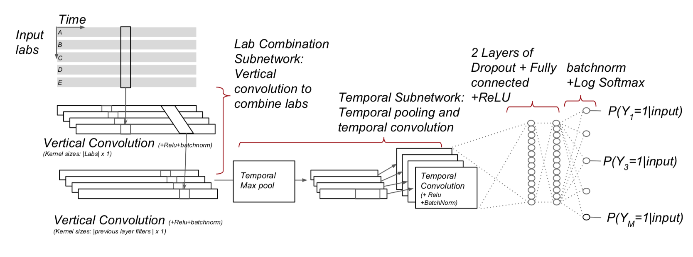

<!--
%\VignetteEngine{knitr}
%\VignetteIndexEntry{Building Deep Learning Models}
-->


```{r setup, include=FALSE}
knitr::opts_chunk$set(echo = TRUE)
```

# Introduction

Electronic Health Records (EHR) data is high dimensional, heterogeneous, and sparse, which makes predictive modelling a challenge. In the early days, the machine learning community mainly focused on algorithm development, currently there is a shift to more powerful feature engineering. Deep Learning models are widely used to automatically learn high-level feature representations from the data, and have achieved remarkable results in image processing,  speech recognition and computational biology. Recently, interesting results have been shown using EHRs, but more extensive research is needed to assess the power of Deep Learning in this domain.

This vignette describes how you can use the Observational Health Data Sciences and Informatics (OHDSI) [`PatientLevelPrediction`](http://github.com/OHDSI/PatientLevelPrediction) package to build Deep Learning models. This vignette assumes you have read and are comfortable with building patient level prediction models as described in the  [`BuildingPredictiveModels` vignette](https://github.com/OHDSI/PatientLevelPrediction/blob/master/inst/doc/BuildingPredictiveModels.pdf). Furthermore, this vignette assumes you are familiar with Deep Learning methods.

# Background

Deep Learning models are build by stacking an often large number of neural network layers that perform feature engineering steps, e.g embedding, and are collapsed in a final softmax layer (basically a logistic regression layer). These algorithms need a lot of data to converge to a good representation, but currently the sizes of the EHR databases are growing fast which would make Deep Learning an interesting approach to test within OHDSI's [Patient-Level Prediction Framework](https://academic.oup.com/jamia/article/25/8/969/4989437). The current implementation allows us to perform research at scale on the value and limitations of Deep Learning using EHR data. For relatively small Target and Outcome cohorts, Deep Learning is most probably not the best choice.

Most current Deep Learning research is performed in python and we have developed a pipeline to interact with python. Multiple Deep Learning backends have been developed, e.g. Tensorflow, PyTorch, Keras (recently also available in R) etc. In the package we have implemented interaction with Keras in R and PyTorch in Python but we invite the community to add other backends.  

Many network architectures have recently been proposed and we have implemented a number of them, however, this list will grow in the near future. It is important to understand that some of these architectures require a 2D data matrix, i.e. |patient|x|feature|, and others use a 3D data matrix |patient|x|feature|x|time|. The [FeatureExtraction Package](www.github.com\ohdsi\FeatureExtraction) has been extended to enable the extraction of both data formats as will be described with examples below.

Note that training Deep Learning models is computationally intensive, our implementation therefore supports both GPU and CPU. It will automatically check whether there is GPU or not in your computer. A GPU is highly recommended for Deep Learning!

# Non-Temporal Architectures
We implemented the following non-temporal (2D data matrix) architectures using PyTorch:

	1) Logistics regression (LRTorch)
	   A simple softmax layer with l2 regularization
	
	2) Feed forward network (MLPTorch) 
	   Supports multilayer perceptron (mlp_type = MLP) and 
	   Self-Normalizing Neural Networks (mlp_type = SNN)
	   Reference: https://arxiv.org/abs/1706.02515

For the above two methods, we implemented support for a stacked autoencoder and a variational autoencoder to reduce the feature dimension as a first step. These autoencoders learn efficient data encodings in an unsupervised manner by stacking multiple layers in a neural network. Compared to the standard implementations of LR and MLP these implementations can use the GPU power to speed up the gradient descent approach in the back propagation to optimize the weights of the classifier.

Table 1: Non-Temporal Deep Learning Models Hyper-Parameters

Name | Description | Hyper-parameters
-------- | --------------------------- | ------------------------------------- 
LRTorch | Logistic Regression Model | w_decay (l2 regularization), epochs (number of epochs), class_weight (0 = inverse ratio between number of positive and negative examples, -1 = focal loss (https://arxiv.org/abs/1708.02002), or other), autoencoder (apply stacked autoencoder?, vae (apply variational autoencoder)
MLPTorch | Multi-Layer Perceptron Model | mlp_type (MLP = default, SNN = self-normalizing neural network), size (number of hidden nodes), w_decay (l2 regularization), epochs (number of epochs), class_weight(0 = inverse ratio between number of positive and negative examples, -1 = focal loss, or other), autoencoder (apply stacked autoencoder), vae (apply variational autoencoder?)

##Example
The approach for logistic regression (LRTorch) and the Multi-Layer Perceptron (MLPTorch) is identical. Here we will take LRTorch as an example.

You need to generate a `population` and `plpData` object as described in more detail in [`BuildingPredictiveModels` vignette](https://github.com/OHDSI/PatientLevelPrediction/blob/master/inst/doc/BuildingPredictiveModels.pdf). 

Alternatively, you can make use of the data simulator. The following code snippet creates a population of 12000 patients.

```{r eval=FALSE}
set.seed(1234)
data(plpDataSimulationProfile)
sampleSize <- 12000
plpData <- simulatePlpData(
  plpDataSimulationProfile,
  n = sampleSize
)

population <- createStudyPopulation(
  plpData,
  outcomeId = 2,
  binary = TRUE,
  firstExposureOnly = FALSE,
  washoutPeriod = 0,
  removeSubjectsWithPriorOutcome = FALSE,
  priorOutcomeLookback = 99999,
  requireTimeAtRisk = FALSE,
  minTimeAtRisk = 0,
  riskWindowStart = 0,
  addExposureDaysToStart = FALSE,
  riskWindowEnd = 365,
  addExposureDaysToEnd = FALSE,
  verbosity = "INFO"
)
```

As an example we will build a LRTorch model. We could specify the stacked autoencoder or the variational autoencoder to be used for reducing the feature dimension as an initial layer, but for this example we do not.

```{r}
autoencoder <- FALSE
vae <- FALSE
```

We added a class_weight for imbalanced data, the default value 0 is the inverse ratio between negatives and positives,-1 applies focal loss.

```{r eval = FALSE}
class_weight <- 0

```

```{r eval=FALSE}
# Specify the settings for Logistics regression model using Torch in Python
model <- setLRTorch(autoencoder=autoencoder, vae=vae,  class_weight=class_weight)
```

No we define our modelling parameters. 

```{r eval = FALSE}
testFraction <- 0.2
testSplit <- 'person'
nfold <- 3
splitSeed <- 1000
```

And we train and internally validate the model.

```{r eval=FALSE}
results <- PatientLevelPrediction::runPlp(population = population, 
                                          plpData = plpData, 
                                          modelSettings = model,
                                          testSplit=testSplit,
                                          testFraction=testFraction,
                                          nfold=nfold, 
                                          splitSeed=splitSeed) 
```

# Temporal Architectures 
Several architectures are implemented that can handle temporal data in PyTorch and R Keras.

## PyTorch CNN

We implemented the following **convolutional** models described in https://github.com/clinicalml/deepDiagnosis in CNNTorch:

1) <dl>
    <dt>Temporal Convolutional neural network over a backward window (type = cnn)</dt>
    <dd></dd>
  </dl>
  
2) <dl>
    <dt>Convolutional neural network over input and time dimension (type = mix)</dt>
    <dd></dd>
  </dl>

3) <dl>
    <dt>Multi-resolution temporal convolutional neural network  (type = multi)</dt>
    <dd></dd>
  </dl>
  
Furthermore, we added the following achitectures:

4) <dl>
    <dt>CNN with filters with three different parallel kernel sizes (3,4,5) and a fully connected layers (type = mlf)</dt>
    <dd></dd>
  </dl>
  
5) <dt>LSTM network over the backward window  (type = lstm) </dt>
    <dd></dd>
  </dl> 
  
6) <dt>Residual Learning Network as described in: https://arxiv.org/abs/1512.03385 (type = resnet) </dt>
    <dd>This a very big network, see the paper for the topology.</dd>
   </dl> 

parameter | description
---------- | --------------------------
nbfilters | The number of convolution filters
epochs    | The number of epochs
seed      | Random seed 
class_weight  | The class weight used for imbalanced data <br> (0: Inverse ratio between positives and negatives, -1: Focal loss, or number)

## PyTorch RNN
The following **recurrent neural network** models are implemented in RNNTorch:

1) <dl>
    <dt>RNN with one LSTM layer fed into one fully connected layer (type = RNN)</dt>
    <dd><dd></dd></dd>
  </dl>

2) <dl>
    <dt>RNN with one bidirectional LSTM layer fed into one fully connected layer (type = BiRNN)</dt>
    <dd>This network looks the same as above but then as a bi-directional version</dd>
  </dl>
  
3) <dl>
    <dt>One Gated Recurrent Unit layer fed into one fully connected layers (type = GRU)</dt>
    <dd>This network looks the same as above but then implemented as GRU</dd>
  </dl>
  
The following hyper-parameters can be set for these PyTorch models:

parameter | description
---------- | --------------------------
hidden_size | The number of features in hidden state
epochs    | The number of epochs
seed      | Random seed 
class_weight  | The class weight used for imbalanced data <br> (0: Inverse ratio between positives and negatives, -1: Focal loss, or number)

\newpage
## R Keras CNN	
The following temporal architectures as described in https://arxiv.org/pdf/1608.00647.pdf were implemented using R Keras:

  1. <dl>
       <dt>Multi-resolution CovNN model (CovNN.R)</dt>
       <dd></dd>
     </dl>
  
  2. <dl>
       <dt>Convolution across data and time according(CovNN2.R)</dt>
       <dd></dd>
     </dl>
\newpage

  Furthermore, a custom build RNN is added that uses a variational autoencoder.
  
  3. <dl>
       <dt>Clinically Informing application based on Recurrent Neural Network (CIReNN.R)</dt>
       <dd></dd>
     </dl>
  
Table 2: Temporal Deep Learning Models

Model |  Hyper-parameters
--------- |  --------------------------------------------------------------------
CovNN | batchSize (The number of samples to used in each batch during model training), outcomeWeight (The weight assigned to the outcome), lr (The learning rate), decay (The decay of the learning rate), dropout ([currently not used] the dropout rate for regularization), epochs (The number of times data is used to train the model, e.g., epoches=1 means data only used once to train), filters (The number of columns output by each convolution), kernelSize (The number of time dimensions used for each convolution), loss (The loss function implemented), seed (The random seed)
CovNN2 | batchSize (The number of samples to used in each batch during model training), outcomeWeight (The weight assigned to the outcome), lr (The learning rate), decay (The decay of the learning rate), dropout ([currently not used] the dropout rate for regularization), epochs (The number of times data is used to train the model, e.g., epoches=1 means data only used once to train), filters (The number of columns output by each convolution), kernelSize (The number of time dimensions used for each convolution), loss (The loss function implemented), seed (The random seed)
CIReNN | units (The number of units of RNN layer - as a list of vectors), recurrentDropout (The reccurrent dropout rate), layerDropout (The layer dropout rate), lr (Learning rate), decay (Learning rate decay over each update), outcomeWeight (The weight of the outcome class in the loss function), batchSize (The number of data points to use per training batch), epochs (Number of times to iterate over data set), earlyStoppingMinDelta (Minimum change in the monitored quantity to qualify as an improvement for early stopping, i.e. an absolute change of less than min_delta in loss of validation data, will count as no improvement), earlyStoppingPatience (Number of epochs with no improvement after which training will be stopped), seed (Random seed used by Deep Learning model)
  

## Example
We will now show how to use the temporal models by using CNNTorch as an example.

You need to generate a `population` and `plpData` object as described in more detail in [`BuildingPredictiveModels` vignette](https://github.com/OHDSI/PatientLevelPrediction/blob/master/inst/doc/BuildingPredictiveModels.pdf). 

Note that for these algorithms you need to extracted temporal data as described in the [FeatureExtraction vignette] (https://github.com/OHDSI/FeatureExtraction/blob/master/inst/doc/UsingFeatureExtraction.pdf) as follows:

```{r eval=FALSE}
settings <- createTemporalCovariateSettings(useConditionEraStart = FALSE,
                                            useConditionEraOverlap = FALSE,
                                            useConditionOccurrence = FALSE,
                                            useConditionEraGroupStart = FALSE,
                                            useConditionEraGroupOverlap = FALSE,
                                            useDrugExposure = FALSE,
                                            useDrugEraStart = FALSE,
                                            useDrugEraOverlap = FALSE,
                                            useMeasurement = FALSE,
                                            useMeasurementValue = TRUE,
                                            useMeasurementRangeGroup = FALSE,
                                            useProcedureOccurrence = FALSE,
                                            useDeviceExposure = FALSE,
                                            useObservation = FALSE,
                                            excludedCovariateConceptIds = c(316866),
                                            addDescendantsToExclude = TRUE,
                                            temporalStartDays = seq(from = -365, 
                                                                    to = -1, by = 12), 
                                            temporalEndDays = c(seq(from = -353, 
                                                                    to = 0, by = 12), 0))

plpData <- getPlpData(connectionDetails = connectionDetails,
                        cdmDatabaseSchema = cdmDatabaseSchema,
                        cohortDatabaseSchema = "results",
                        cohortTable = "cohort",
                        cohortId = 11,
                        covariateSettings = settings,
                        outcomeDatabaseSchema = resultsDatabaseSchema,
                        outcomeTable = "cohort",
                        outcomeIds = 25,
                        cdmVersion = 5)

```

Each CNN/RNN has several hyper-parameters that can be set as shown in the Tables above, but for this example we take the defaults. 

```{r eval=FALSE}
# specify the the CNN
model <- setCNNTorch(cnn_type='CNN')
```

Run the model training, for example with a testFraction = 0.2 and a split by person:

```{r eval=FALSE}
results <- PatientLevelPrediction::runPlp(population, plpData, model,
                                          testSplit='person',
                                          testFraction=0.2,
                                          nfold=3, 
                                          splitSeed=1000) 
```

# Apply the trained Deep Learning model
Applying a Deep Learning is identical to the other models in the package:

```{r eval=FALSE}
# load the trained model
plpModel <- loadPlpModel(getwd(), "<your model>")

# load the new plpData (should have the same temporal features!) and create the population
plpData <- loadPlpData(getwd(), "<your data>")

populationSettings <- plpModel$populationSettings
populationSettings$plpData <- plpData
population <- do.call(createStudyPopulation, populationSettings)  

# apply the trained model on the new data
validationResults <- applyModel(population, plpData, plpModel)
```

# Adding new architectures

It is possible to add new architectures in our framework using PyTorch or R Keras. We are happy to help you with this, please post your questions on the [issue tracker](www.github.com/OHDSI/PatientLevelPrediction/issues) of the package.

# Acknowledgments

Considerable work has been dedicated to provide the `PatientLevelPrediction` package.

```{r tidy=TRUE,eval=TRUE}
citation("PatientLevelPrediction")
```

**Please reference this paper if you use the PLP Package in your work:**

[Reps JM, Schuemie MJ, Suchard MA, Ryan PB, Rijnbeek PR. Design and implementation of a standardized framework to generate and evaluate patient-level prediction models using observational healthcare data. J Am Med Inform Assoc. 2018;25(8):969-975.](http://dx.doi.org/10.1093/jamia/ocy032)