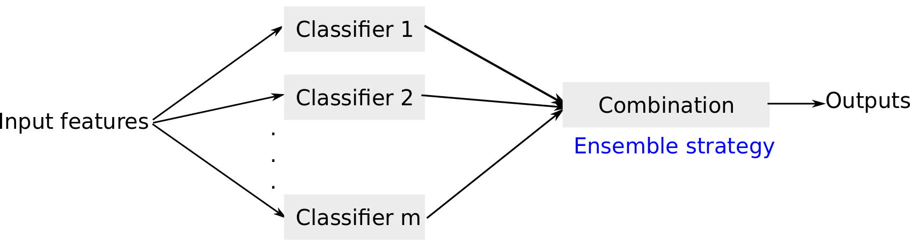

<!--
%\VignetteEngine{knitr}
%\VignetteIndexEntry{Building Ensemble Models}
-->

```{r setup, include=FALSE}
knitr::opts_chunk$set(echo = TRUE)
```

# Introduction
Ensemble models combine several models to improve the overall performance. Traditionally, weak learners were combined to boost performance but recent results show that combining several strong approaches can also result in a better performance. There are many examples in literature where ensemble models outperform individual models using stacking, i.e. a final logistic regresssion layer accross the individual model outputs, but other approaches like weigthing has also shown promising results. 

This vignette describes how you can use the Observational Health Data Sciencs and Informatics (OHDSI) [`PatientLevelPrediction`](http://github.com/OHDSI/PatientLevelPrediction) package to build ensemble models. This vignette assumes you have read and are comfortable with building single patient level prediction models as described in the  [`BuildingPredictiveModels` vignette](https://github.com/OHDSI/PatientLevelPrediction/blob/master/inst/doc/BuildingPredictiveModels.pdf).

This will enable studying ensemble methods at scale in the OHDSI data network.



In PatientLevelPrediction package, four ensemble strategies have been implemented:

1. average ensemble: Calculate the average probability from individual models
2. product ensemble:  Calculate the product of probabilites from individual models.
3. weighted ensemble: Calculate the weighted average probability from individual models using train AUC as weights.
4. stacked ensemble:  Train a logistics regression on outputs from individual models

# Usage

Use the [`PatientLevelPrediction`](http://github.com/OHDSI/PatientLevelPrediction) package to generate a `population` and `plpData` object. Alternatively, you can make use of the data simulator. The following code snippet creates a population of 12000 patients.

```{r eval=FALSE}
data(plpDataSimulationProfile)
set.seed(1234)
sampleSize <- 2000
plpData <- simulatePlpData(
  plpDataSimulationProfile,
  n = sampleSize
)

population <- createStudyPopulation(
  plpData,
  outcomeId = 2,
  binary = TRUE,
  firstExposureOnly = FALSE,
  washoutPeriod = 0,
  removeSubjectsWithPriorOutcome = FALSE,
  priorOutcomeLookback = 99999,
  requireTimeAtRisk = FALSE,
  minTimeAtRisk = 0,
  riskWindowStart = 0,
  addExposureDaysToStart = FALSE,
  riskWindowEnd = 365,
  addExposureDaysToEnd = FALSE,
  verbosity = "INFO"
)
```

Specify the prediction algorithms to be combined.

```{r eval=FALSE}
# Use LASSO logistic regression and Random Forest as base predictors
model1 <- setLassoLogisticRegression()
model2 <- setRandomForest()
```

Specify a test fraction and a sequence of training set fractions.

```{r eval = FALSE}
testFraction <- 0.2
```

Specify an ensembleStrategy to combine multiple predictors. 
The strategy used for ensembling the outputs from different models, 
it can be 'mean', 'product',  'weighted' and 'stacked':
'mean'     the average probability from differnt models
'product'  the product rule
'weighted' the weighted average probability from different models using train AUC as weights.
'stacked'  the stakced ensemble trains a logistics regression on different models.

```{r eval = FALSE}
ensembleStrategy <- 'stacked'
```

Specify the test split to be used.

```{r}
# Use a split by person, alterantively a time split is possible
testSplit <- 'person'
```

Run the ensemble learning to combine model1 and model2. You can also use different plpData for different models.

```{r eval=FALSE}
ensembleResults <- PatientLevelPrediction::runEnsembleModel(population, 
                                   dataList = list(plpData, plpData), 
                                   modelList = list(model1, model2),
                                   testSplit=testSplit,
                                   testFraction=testFraction,
                                   nfold=3, splitSeed=1000, 
                                   ensembleStrategy = ensembleStrategy) 
```
## Saving and loading the ensemble model

You can save and load the model using:

```{r tidy=TRUE,eval=FALSE}
saveEnsemblePlpModel(ensembleResults$model, dirPath = file.path(getwd(),'model'))
ensembleModel <- loadEnsemblePlpModel(getwd(),'model')
```

# Apply Ensemble model
```{r eval=FALSE}
plpData <- loadPlpData("<data file>")
populationSettings <- ensembleModel$populationSettings
populationSettings$plpData <- plpData
population <- do.call(createStudyPopulation, populationSettings)
```
Load the model.
```{r eval=FALSE}
ensembleModel <- loadEnsemblePlpModel("<model folder>")
```

Get the predictions by applying the model:
```{r eval=FALSE}
prediction <- applyEnsembleModel(population,
                                  dataList = list(plpData, plpData),
                                  ensembleModel = ensembleModel)$prediction
```

# Demo

We have added a demo of the ensemble training:

``` {r eval=FALSE}
# Show all demos in our package: 
 demo(package = "PatientLevelPrediction")

# Run the learning curve
 demo("EnsembleModelDemo", package = "PatientLevelPrediction")
```
# Acknowledgments

Considerable work has been dedicated to provide the `PatientLevelPrediction` package.

```{r tidy=TRUE,eval=TRUE}
citation("PatientLevelPrediction")
```

**Please reference this paper if you use the PLP Package in your work:**

[Reps JM, Schuemie MJ, Suchard MA, Ryan PB, Rijnbeek PR. Design and implementation of a standardized framework to generate and evaluate patient-level prediction models using observational healthcare data. J Am Med Inform Assoc. 2018;25(8):969-975.](http://dx.doi.org/10.1093/jamia/ocy032)