<!--
%\VignetteEngine{knitr}
%\VignetteIndexEntry{Building patient-level predictive models}
-->

  
```{r echo=FALSE,message=FALSE,warning=FALSE,eval=TRUE}
library(PatientLevelPrediction)
vignetteDataFolder <- "s:/temp/plpVignette"
# Load all needed data if it exists on this computer:
if (file.exists(vignetteDataFolder)){
  plpModel <- loadPlpModel(vignetteDataFolder,'model')
  lrResults <- loadPlpModel(file.path(vignetteDataFolder,'results'))
} 
```

```{r, echo = FALSE, message = FALSE, warning = FALSE}
library(PatientLevelPrediction)
```

# Introduction

Observational healthcare data, such as administrative claims and electronic health records, are increasingly used for clinical characterization of disease progression, quality improvement, and population-level effect estimation for medical product safety surveillance and comparative effectiveness. Advances in machine learning for large dataset analysis have led to increased interest in applying patient-level prediction on this type of data. Patient-level prediction offers the potential for medical practice to move beyond average treatment effects and to consider personalized risks as part of clinical decision-making. However, many published efforts in patient-level-prediction do not follow the model development guidelines, fail to perform extensive external validation, or provide insufficient model details that limits the ability of independent researchers to reproduce the models and perform external validation. This makes it hard to fairly evaluate the predictive performance of the models and reduces the likelihood of the model being used appropriately in clinical practice. To improve standards, several papers have been written detailing guidelines for best practices in developing and reporting prediction models.

The Transparent Reporting of a multivariable prediction model for [`Individual Prognosis Or Diagnosis (TRIPOD) statement`](https://www.equator-network.org/reporting-guidelines/tripod-statement/) provides clear recommendations for reporting prediction model development and validation and addresses some of the concerns related to transparency. However, data structure heterogeneity and inconsistent terminologies still make collaboration and model sharing difficult as different researchers are often required to write new code to extract the data from their databases and may define variables differently.

In our [`paper`](https://academic.oup.com/jamia/article/25/8/969/4989437), we propose a standardised framework for patient-level prediction that utilizes the OMOP Common Data Model (CDM) and standardized vocabularies, and describe the open-source software that we developed implementing the framework’s pipeline. The framework is the first to support existing best practice guidelines and will enable open dissemination of models that can be extensively validated across the network of OHDSI collaborators.

Figure 1, illustrates the prediction problem we address. Among a population at risk, we aim to predict which patients at a defined moment in time (t = 0) will experience some outcome during a time-at-risk. Prediction is done using only information about the patients in an observation window prior to that moment in time.


As shown in Figure 2, to define a prediction problem we have to define t=0 by a Target Cohort (T), the outcome we like to predict by an outcome cohort (O), and the time-at-risk (TAR). Furthermore, we  have to make design choices for the model we like to develop, and determine the observational datasets to perform internal and external validation. This conceptual framework works for all type of prediction problems, for example those presented in Figure 3.

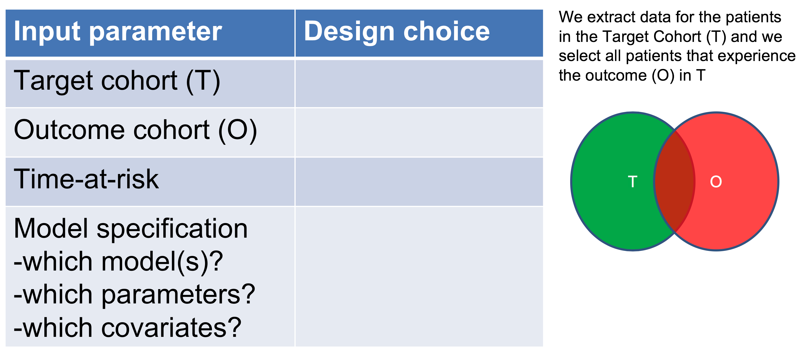


This vignette describes how you can use the `PatientLevelPrediction` package to build patient-level predictive models. The package enables data extraction, model building, and model evaluation using data from databases that are translated into the OMOP CDM. In this vignette we assume you have installed the package correctly using the [`InstallationGuide`](https://github.com/OHDSI/PatientLevelPrediction/blob/main/inst/doc/InstallationGuide.pdf).

# Study specification

We have to clearly specify our study upfront to be able to implement it. This means we need to define the prediction problem we like to address, in which population we will build the model, which model we will build and how we will evaluate its performance. To guide you through this process we will use a "Disease onset and progression" prediction type as an example.

## Problem definition 1: Stroke in afibrilation patients

Atrial fibrillation is a disease characterized by an irregular heart rate that can cause poor blood flow. Patients with atrial fibrillation are at increased risk of ischemic stroke.  Anticoagulation is a recommended prophylaxis treatment strategy for patients at high risk of stroke, though the underuse of anticoagulants and persistent severity of ischemic stroke represents a substantial unmet medical need.  Various strategies have been developed to predict risk of ischemic stroke in patients with atrial fibrillation.  CHADS2 (Gage JAMA 2001) was developed as a risk score based on history of congestive heart failure, hypertension, age>=75, diabetes and stroke.  CHADS2 was initially derived using Medicare claims data, where it achieved good discrimination (AUC=0.82).  However, subsequent external validation studies revealed the CHADS2 had substantially lower predictive accuracy (Keogh Thromb Haemost 2011).  Subsequent stroke risk calculators have been developed and evaluated, including the extension of CHADS2Vasc.  The management of atrial fibrillation has evolved substantially over the last decade, for various reasons that include the introduction of novel oral anticoagulants.  With these innovations has come a renewed interest in greater precision medicine for stroke prevention. 

We will apply the PatientLevelPrediction package to observational healthcare data to address the following patient-level prediction question:
  
Amongst patients who are newly diagnosed with Atrial Fibrillation, which patients will go on to have Ischemic Stroke within 1 year? 
  
We will define 'patients who are newly diagnosed with Atrial Fibrillation' as the first condition record of cardiac arrhythmia, which is followed by another cardiac arrhythmia condition record, at least two drug records for a drug used to treat arrhythmias, or a procedure to treat arrhythmias.  We will define 'Ischemic stroke events' as ischemic stroke condition records during an inpatient or ER visit;  successive records with > 180 day gap are considered independent episodes.

## Problem definition 2: Angioedema in ACE inhibitor users

Angiotensin converting enzyme inhibitors (ACE inhibitors) are medications used by patients with hypertension that widen the blood vessles and therefore increse the amount of blood pumped by the heart and decreases blood pressure.  Ace inhibitors reduce a patients risk of cardiovasular disease but can lead to drug-induced angioedema.

We will apply the PatientLevelPrediction package to observational healthcare data to address the following patient-level prediction question:
  
Amongst patients who are newly dispensed an ACE inhibitor, which patients will go on to have angioedema within 1 year? 
  
We will define 'patients who are newly dispensed an ACE inhibitor' as the first drug record of sny ACE inhibitor, [...]which is followed by another cardiac arrhythmia condition record, at least two drug records for a drug used to treat arrhythmias, or a procedure to treat arrhythmias.  We will define 'angioedema' as an angioedema condition record.


## Study population definition

The final study population in which we will develop our model is often a subset of the Target population, because we will e.g. apply criteria that are dependent on T and O or we want to do sensitivity analyses with subpopulations of T.  For this we have to answer the following questions:
  
- *What is the minimum amount of observation time we require before the start of the target cohort?* This choice could depend on the available patient time in your training data, but also on the time you expect  to be available in the data sources you want to apply the model on in the future. The longer the minimum observation time, the more baseline history time is available for each person to use for feature extraction, but the fewer patients will qualify for analysis.  Moreover, there could  be clinical reasons to choose a short or longer lookback period. For our example, we will use a prior history as lookback period (washout period).

- *Can patients enter the target cohort multiple times?* In the target cohort definition, a person may qualify for the cohort multiple times during different spans of time, for example if they had different episodes of a disease or separate periods of exposure to a medical product.  The cohort definition does not necessarily apply a restriction to only let the patients enter once, but in the context of a particular patient-level prediction problem, a user may want to restrict the cohort to the first qualifying episode. In our example, a person could only enter the target cohort once since our criteria was based on first occurrence of atrial fibrillation. 

- *Do we allow persons to enter the cohort if they experienced the outcome before?* Do we allow persons to enter the target cohort if they experienced the outcome before qualifying for the target cohort?  Depending on the particular patient-level prediction problem, there may be a desire to predict ‘incident’ first occurrence of an outcome, in which case patients who have previously experienced the outcome are not ‘at-risk’ for having a first occurrence and therefore should be excluded from the target cohort.  In other circumstances, there may be a desire to predict ‘prevalent’ episodes, whereby patients with prior outcomes can be included in the analysis and the prior outcome itself can be a predictor of future outcomes.  For our prediction example, the answer to this question is ‘Yes, allow persons with prior outcomes’ because we know from the CHADS2 score that prior strokes are very predictive of future strokes. If this answer would have been ‘No’ we also have to decide how long we would look back for previous occurrences of the outcome.

- *How do we define the period in which we will predict our outcome relative to the target cohort start?* We actually have to make two decisions to answer that question. First, does the time-at-risk window start at the date of the start of the target cohort or later? Arguments to make it start later could be that you want to avoid outcomes that were entered late in the record that actually occurred before the start of the target cohort or you want to leave a gap where interventions to prevent the outcome could theoretically be implemented. Second, you need to define the time-at-risk by setting the risk window end, as some specification of days offset relative to the target cohort start or end dates. For our problem we will predict in a ‘time-at-risk’ window starting 1 day after the start of the target cohort up to 365 days later (to look for 1-year risk following atrial fibrillation diagnosis).


- *Do we require a minimum amount of time-at-risk?* We have to decide if we want to include patients that did not experience the outcome but did leave the database earlier than the end of our time-at-risk period. These patients may experience the outcome when we do not observe them. For our  prediction problem we decide to answer this question with ‘Yes, require a mimimum time-at-risk’ for that reason. Furthermore, we have to decide if this constraint also applies to persons who experienced the outcome or we will include all persons with the outcome irrespective of their total time at risk. For example, if the outcome is death, then persons with the outcome are likely censored before the full time-at-risk period is complete.

## Model development settings

To develop the model we have to decide which algorithm(s) we like to train. We see the selection of the best algorithm for a certain prediction problem as an empirical question, i.e. you need to let the data speak for itself and try different approaches to find the best one. There is no algorithm that will work best for all problems (no free lunch). In our package we therefore aim to implement many algorithms. Furthermore, we made the system modular so you can add your own custom algorithms as described in more detail in the [`AddingCustomModels`](https://github.com/OHDSI/PatientLevelPrediction/blob/master/inst/doc/AddingCustomModels.pdf) vignette. 

Our package currently contains the following algorithms to choose from:

```{r table2, echo=FALSE, message=FALSE, warnings=FALSE, results='asis'}
tabl <- "   
| Algorihm | Description | Hyper-parameters |
| ----------| ---------------------------------------------------| ----------------------- |
| Regularized Logistic Regression | Lasso logistic regression belongs to the family of generalized linear models, where a linear combination of the variables is learned and finally a logistic function maps the linear combination to a value between 0 and 1.  The lasso regularization adds a cost based on model complexity to the objective function when training the model.  This cost is the sum of the absolute values of the linear combination of the coefficients.  The model automatically performs feature selection by minimizing this cost. We use the Cyclic coordinate descent for logistic, Poisson and survival analysis (Cyclops) package to perform large-scale regularized logistic regression: https://github.com/OHDSI/Cyclops | var  (starting  variance), seed |
| Gradient boosting machines | Gradient boosting machines is a boosting ensemble technique and in our framework it combines multiple decision trees.  Boosting works by iteratively adding decision trees but adds more weight to the data-points that are misclassified by prior decision trees in the cost function when training the next tree.  We use Extreme Gradient Boosting, which is an efficient implementation of the gradient boosting framework implemented in the xgboost R package available from CRAN. | ntree (number of trees), max depth (max levels in tree), min rows (minimum data points in in node), learning rate, balance (balance class labels), seed  |
| Random forest | Random forest is a bagging ensemble technique that combines multiple decision trees.  The idea behind bagging is to reduce the likelihood of overfitting, by using weak classifiers, but combining multiple diverse weak classifiers into a strong classifier.  Random forest accomplishes this by training multiple decision trees but only using a subset of the variables in each tree and the subset of variables differ between trees. Our packages uses the sklearn learn implementation of Random Forest in python. | mtry  (number  of  features  in  each  tree),ntree (number of trees), maxDepth (max levels in tree), minRows (minimum data points in in node),balance (balance class labels), seed  |
| K-nearest neighbors | K-nearest neighbors (KNN) is an algorithm that uses some metric to find the K closest labelled data-points, given the specified metric, to a new unlabelled data-point.  The prediction of the new data-points is then the most prevalent class of the K-nearest labelled data-points.  There is a sharing limitation of KNN, as the model requires labelled data to perform the prediction on new data, and it is often not possible to share this data across data sites.We included the BigKnn classifier developed in OHDSI which is a large scale k-nearest neighbor classifier using the Lucene search engine: https://github.com/OHDSI/BigKnn | k (number   of   neighbours),weighted (weight by inverse frequency)  |
| Naive Bayes | The Naive Bayes algorithm applies the Bayes theorem with the 'naive' assumption of conditional independence between every pair of features given the value of the class variable. Based on the likelihood the data belongs to a class and the prior distribution of the class, a posterior distribution is obtained.  | none |
| AdaBoost | AdaBoost is a boosting ensemble technique. Boosting works by iteratively adding classifiers but adds more weight to the data-points that are misclassified by prior classifiers in the cost function when training the next classifier. We use the sklearn 'AdaboostClassifier' implementation in Python. | nEstimators (the maximum number of estimators at which boosting is terminated), learningRate (learning rate shrinks the contribution of each classifier by learning_rate. There is a trade-off between learningRate and nEstimators) |
| Decision Tree | A decision tree is a classifier that partitions the variable space using individual tests selected using a greedy approach.  It aims to find partitions that have the highest information gain to separate the classes.  The decision tree can easily overfit by enabling a large number of partitions (tree depth) and often needs some regularization (e.g., pruning or specifying hyper-parameters that limit the complexity of the model). We use the sklearn 'DecisionTreeClassifier' implementation in Python. | maxDepth (the maximum depth of the tree), minSamplesSplit,minSamplesLeaf, minImpuritySplit (threshold for early stopping in tree growth. A node will split if its impurity is above the threshold, otherwise it is a leaf.), seed,classWeight ('Balance' or 'None') |
| Multilayer Perception | Neural networks contain multiple layers that weight their inputs using a non-linear function.  The first layer is the input layer, the last layer is the output layer the between are the hidden layers.  Neural networks are generally trained using feed forward back-propagation.  This is when you go through the network with a data-point and calculate the error between the true label and predicted label, then go backwards through the network and update the linear function weights based on the error.  This can also be performed as a batch, where multiple data-points are fee| size (the number of hidden nodes), alpha (the l2 regularisation), seed |
| Deep Learning (now in seperate DeepPatientLevelPrediction R package) | Deep learning such as deep nets, convolutional neural networks or recurrent neural networks are similar to a neural network but have multiple hidden layers that aim to learn latent representations useful for prediction. In the seperate BuildingDeepLearningModels vignette we describe these models and hyper-parameters in more detail | see OHDSI/DeepPatientLevelPrediction|
"
cat(tabl) # output the table in a format good for HTML/PDF/docx conversion
```

Furthermore, we have to decide on the **covariates** that we will use to train our model. This choice can be driven by domain knowledge of available computational resources. In our example, we like to add the Gender, Age, Conditions, Drugs Groups, and Visit Count. We also have to specify in which time windows we will look and we decide to look in year before and any time prior.

Finally, we have to define how we will train and test our model on our data, i.e. how we perform **internal validation**. For this we have to decide how we divide our dataset in a training and testing dataset and how we randomly assign patients to these two sets. Dependent on the size of the training set we can decide how much data we like to use for training, typically this is a 75%, 25% split. If you have very large datasets you can use more data for training. To randomly assign patients to the training and testing set, there are two commonly used approaches:
  
1. split by person. In this case a random seed is used to assign the patient to either sets.
2. split by time. In this case a time point is used to split the persons, e.g. 75% of the data is before and 25% is after this date. The advantage of this is that you take into consideration that the health care system has changed over time.

We now completely defined our studies and implement them:

- [See example 1: Stroke in afibrilation patients](#example1)
- [See example 2: Agioedema in ACE inhibitor new users](#example2)
      
# Example 1: Stroke in afibrilation patients {#example1}

## Study Specification

For our first prediction model we decide to start with a Regularized Logistic Regression and will use the default parameters. We will do a 75%-25% split by person.
      
Definition | Value
-------------------------------| -------------------------------------- |
**Problem Definition** | |
Target Cohort (T) |  'Patients who are newly diagnosed with Atrial Fibrillation' defined as the first condition record of cardiac arrhythmia, which is followed by another cardiac arrhythmia condition record, at least two drug records for a drug used to treat arrhythmias, or a procedure to treat arrhythmias. |
Outcome Cohort (O) | 'Ischemic stroke events' defined as ischemic stroke condition records during an inpatient or ER visit;  successive records with > 180 day gap are considered independent episodes. |
Time-at-risk (TAR) | 1 day till 365 days from cohort start|
| |
**Population Definition** | |
Washout Period | 1095 |
Enter the target cohort multiple times? | No|
Allow prior outcomes? | Yes |
Start of time-at-risk | 1 day |
End of time-at-risk | 365 days |
Require a minimum amount of time-at-risk? | Yes (364 days)
| |
**Model Development** | |
Algorithm |  Regularized Logistic Regression |
Hyper-parameters | variance = 0.01 (Default)
Covariates | Gender, Age, Conditions (ever before, <365), Drugs Groups (ever before, <365), and Visit Count
Data split | 75% train, 25% test. Randomly assigned by person
      
According to the best practices we need to make a protocol that completely specifies how we plan to execute our study. This protocol will be assessed by the governance boards of the participating data sources in your network study. For this a template could be used but we prefer to automate this process as much as possible by adding functionality to automatically generate study protocol from a study specification. We will discuss this in more detail later.
      
## Study implementation
      
Now we have completely design our study we have to implement the study. We have to generate the target and outcome cohorts and we need to develop the R code to run against our CDM that will execute the full study.
      
### Cohort instantiation
      
For our study we need to know when a person enters the target and outcome cohorts. This is stored in a table on the server that contains the cohort start date and cohort end date for all subjects for a specific cohort definition. This cohort table has a very simple structure as shown below:
        
- `cohort_definition_id`, a unique identifier for distinguishing between different types of cohorts, e.g. cohorts of interest and outcome cohorts.
- `subject_id`, a unique identifier corresponding to the `person_id` in the CDM.
- `cohort_start_date`, the date the subject enters the cohort.
- `cohort_end_date`, the date the subject leaves the cohort.
      
How do we fill this table according to our cohort definitions? There are two options for this: 
        
1) use the interactive cohort builder tool in [ATLAS](www.github.com/OHDSI/ATLAS) which can be used to create cohorts based on inclusion criteria and will automatically populate this cohort table.
    
2) write your own custom SQL statements to fill the cohort table. 

Both methods are described below for our example prediction problem.

### ATLAS cohort builder


ATLAS allows you to define cohorts interactively by specifying cohort entry and cohort exit criteria. Cohort entry criteria involve selecting one or more initial events, which determine the start date for cohort entry, and optionally specifying additional inclusion criteria which filter to the qualifying events. Cohort exit criteria are applied to each cohort entry record to determine the end date when the person's episode no longer qualifies for the cohort. For the outcome cohort the end date is less relevant. As an example, Figure 4 shows how we created the Atrial Fibrillation cohort and Figure 5 shows how we created the stroke cohort in ATLAS. 


The T and O cohorts can be found here: 

- Atrial Fibrillaton (T): http://www.ohdsi.org/web/atlas/#/cohortdefinition/1769447
- Stroke (O) : http://www.ohdsi.org/web/atlas/#/cohortdefinition/1769448

In depth explanation of cohort creation in ATLAS is out of scope of this vignette but can be found on the OHDSI wiki pages [(link)](http://www.ohdsi.org/web/wiki/doku.php?id=documentation:software:atlas). 

Note that when a cohort is created in ATLAS the cohortid is needed to extract the data in R. The cohortid can be found at the top of the ATLAS screen, e.g. 1769447 in Figure 4. 

### Custom cohorts

It is also possible to create cohorts without the use of ATLAS. Using custom cohort code (SQL) you can make more advanced cohorts if needed.

For our example study, we need to create at table to hold the cohort data and we need to create SQL code to instantiate this table for both the AF and Stroke cohorts. Therefore, we create a file called *AfStrokeCohorts.sql* with the following contents:

```{sql, eval=FALSE}
/***********************************
File AfStrokeCohorts.sql 
***********************************/
/*
Create a table to store the persons in the T and C cohort
*/

IF OBJECT_ID('@resultsDatabaseSchema.PLPAFibStrokeCohort', 'U') IS NOT NULL 
DROP TABLE @resultsDatabaseSchema.PLPAFibStrokeCohort;

CREATE TABLE @resultsDatabaseSchema.PLPAFibStrokeCohort 
( 
cohort_definition_id INT, 
subject_id BIGINT,
cohort_start_date DATE, 
cohort_end_date DATE
);


/*
T cohort:  [PatientLevelPrediction vignette]:  T : patients who are newly 
diagnosed with Atrial fibrillation
- persons with a condition occurrence record of 'Atrial fibrillation' or 
any descendants, indexed at the first diagnosis
- who have >1095 days of prior observation before their first diagnosis
- and have no warfarin exposure any time prior to first AFib diagnosis
*/
INSERT INTO @resultsDatabaseSchema.AFibStrokeCohort (cohort_definition_id, 
subject_id, 
cohort_start_date, 
cohort_end_date)
SELECT 1 AS cohort_definition_id,
AFib.person_id AS subject_id,
AFib.condition_start_date AS cohort_start_date,
observation_period.observation_period_end_date AS cohort_end_date
FROM
(
  SELECT person_id, min(condition_start_date) as condition_start_date
  FROM @cdmDatabaseSchema.condition_occurrence
  WHERE condition_concept_id IN (SELECT descendant_concept_id FROM 
  @cdmDatabaseSchema.concept_ancestor WHERE ancestor_concept_id IN 
  (313217 /*atrial fibrillation*/))
  GROUP BY person_id
) AFib
  INNER JOIN @cdmDatabaseSchema.observation_period
  ON AFib.person_id = observation_period.person_id
  AND AFib.condition_start_date >= dateadd(dd,1095, 
  observation_period.observation_period_start_date)
  AND AFib.condition_start_date <= observation_period.observation_period_end_date
  LEFT JOIN
  (
  SELECT person_id, min(drug_exposure_start_date) as drug_exposure_start_date
  FROM @cdmDatabaseSchema.drug_exposure
  WHERE drug_concept_id IN (SELECT descendant_concept_id FROM 
  @cdmDatabaseSchema.concept_ancestor WHERE ancestor_concept_id IN 
  (1310149 /*warfarin*/))
  GROUP BY person_id
  ) warfarin
  ON Afib.person_id = warfarin.person_id
  AND Afib.condition_start_date > warfarin.drug_exposure_start_date
  WHERE warfarin.person_id IS NULL
  ;
  
  /*
  C cohort:  [PatientLevelPrediction vignette]:  O: Ischemic stroke events
  - inpatient visits that include a condition occurrence record for 
  'cerebral infarction' and descendants, 'cerebral thrombosis', 
  'cerebral embolism', 'cerebral artery occlusion' 
  */
  INSERT INTO @resultsDatabaseSchema.AFibStrokeCohort (cohort_definition_id, 
  subject_id, 
  cohort_start_date, 
  cohort_end_date)
  SELECT 2 AS cohort_definition_id,
  visit_occurrence.person_id AS subject_id,
  visit_occurrence.visit_start_date AS cohort_start_date,
  visit_occurrence.visit_end_date AS cohort_end_date
  FROM  
  (
  SELECT person_id, condition_start_date
  FROM @cdmDatabaseSchema.condition_occurrence
  WHERE condition_concept_id IN (SELECT DISTINCT descendant_concept_id FROM 
  @cdmDatabaseSchema.concept_ancestor WHERE ancestor_concept_id IN 
  (443454 /*cerebral infarction*/) OR descendant_concept_id IN 
  (441874 /*cerebral thrombosis*/, 375557 /*cerebral embolism*/, 
  372924 /*cerebral artery occlusion*/))
  ) stroke
  INNER JOIN @cdmDatabaseSchema.visit_occurrence
  ON stroke.person_id = visit_occurrence.person_id
  AND stroke.condition_start_date >= visit_occurrence.visit_start_date
  AND stroke.condition_start_date <= visit_occurrence.visit_end_date
  AND visit_occurrence.visit_concept_id IN (9201, 262 /*'Inpatient Visit'  or 
  'Emergency Room and Inpatient Visit'*/)
  GROUP BY visit_occurrence.person_id, visit_occurrence.visit_start_date, 
  visit_occurrence.visit_end_date
  ;
  
```
This is parameterized SQL which can be used by the [`SqlRender`](http://github.com/OHDSI/SqlRender) package. We use parameterized SQL so we do not have to pre-specify the names of the CDM and result schemas. That way, if we want to run the SQL on a different schema, we only need to change the parameter values; we do not have to change the SQL code. By also making use of translation functionality in `SqlRender`, we can make sure the SQL code can be run in many different environments.
  
To execute this sql against our CDM we first need to tell R how to connect to the server. `PatientLevelPrediction` uses the [`DatabaseConnector`](http://github.com/ohdsi/DatabaseConnector) package, which provides a function called `createConnectionDetails`. Type `?createConnectionDetails` for the specific settings required for the various database management systems (DBMS). For example, one might connect to a PostgreSQL database using this code:
  
```{r tidy=FALSE,eval=FALSE}
  connectionDetails <- createConnectionDetails(dbms = "postgresql", 
  server = "localhost/ohdsi", 
  user = "joe", 
  password = "supersecret")
  
  cdmDatabaseSchema <- "my_cdm_data"
  cohortsDatabaseSchema <- "my_results"
  cdmVersion <- "5"
```
  
The last three lines define the `cdmDatabaseSchema` and `cohortsDatabaseSchema` variables, as well as the CDM version. We will use these later to tell R where the data in CDM format live, where we want to create the cohorts of interest, and what version CDM is used. Note that for Microsoft SQL Server, databaseschemas need to specify both the database and the schema, so for example `cdmDatabaseSchema <- "my_cdm_data.dbo"`.
  
  
```{r tidy=FALSE,eval=FALSE}
  library(SqlRender)
  sql <- readSql("AfStrokeCohorts.sql")
  sql <- renderSql(sql,
  cdmDatabaseSchema = cdmDatabaseSchema,
  cohortsDatabaseSchema = cohortsDatabaseSchema,
  post_time = 30,
  pre_time = 365)$sql
  sql <- translateSql(sql, targetDialect = connectionDetails$dbms)$sql
  
  connection <- connect(connectionDetails)
  executeSql(connection, sql)
```
  
In this code, we first read the SQL from the file into memory. In the next line, we replace four parameter names with the actual values. We then translate the SQL into the dialect appropriate for the DBMS we already specified in the `connectionDetails`. Next, we connect to the server, and submit the rendered and translated SQL.
  
If all went well, we now have a table with the events of interest. We can see how many events per type:
  
```{r tidy=FALSE,eval=FALSE}
  sql <- paste("SELECT cohort_definition_id, COUNT(*) AS count",
  "FROM @cohortsDatabaseSchema.AFibStrokeCohort",
  "GROUP BY cohort_definition_id")
  sql <- renderSql(sql, cohortsDatabaseSchema = cohortsDatabaseSchema)$sql
  sql <- translateSql(sql, targetDialect = connectionDetails$dbms)$sql
  
  querySql(connection, sql)
  ```
  ```{r echo=FALSE,message=FALSE}
  data.frame(cohort_definition_id = c(1, 2),count = c(527616, 221555))
```
  
### Study script creation
  
In this section we assume that our cohorts have been created either by using ATLAS or a custom SQL script. We will first explain how to create an R script yourself that will execute our study as we have defined earlier. 
  
### Data extraction
  
Now we can tell `PatientLevelPrediction` to extract all necessary data for our analysis. This is done using the [`FeatureExtractionPackage`](https://github.com/OHDSI/FeatureExtraction). In short the FeatureExtractionPackage allows you to specify which features (covariates) need to be extracted, e.g. all conditions and drug exposures. It also supports the creation of custom covariates. For more detailed information on the FeatureExtraction package see its [vignettes](https://github.com/OHDSI/FeatureExtraction). For our example study we decided to use these settings:
  
```{r tidy=FALSE,eval=FALSE}		   
  covariateSettings <- createCovariateSettings(useDemographicsGender = TRUE,
  useDemographicsAge = TRUE,
  useConditionGroupEraLongTerm = TRUE,
  useConditionGroupEraAnyTimePrior = TRUE,
  useDrugGroupEraLongTerm = TRUE,
  useDrugGroupEraAnyTimePrior = TRUE,
  useVisitConceptCountLongTerm = TRUE,
  longTermStartDays = -365,
  endDays = -1)
```
  
The final step for extracting the data is to run the `getPlpData` function and input the connection details, the database schema where the cohorts are stored, the cohort definition ids for the cohort and outcome, and the washoutPeriod which is the minimum number of days prior to cohort index date that the person must have been observed to be included into the data, and finally input the previously constructed covariate settings. 
  
```{r tidy=FALSE,eval=FALSE}

databaseDetails <- createDatabaseDetails(
  connectionDetails = connectionDetails,
  cdmDatabaseSchema = cdmDatabaseSchema,
  cdmDatabaseName = '',
  cohortDatabaseSchema = resultsDatabaseSchema,
  cohortTable = 'AFibStrokeCohort',
  cohortId = 1,
  outcomeDatabaseSchema = resultsDatabaseSchema,
  outcomeTable = 'AFibStrokeCohort',
  outcomeIds = 2,
  cdmVersion = 5
  )

# here you can define whether you want to sample the target cohort and add any
# restrictions based on minimum prior observation, index date restrictions
# or restricting to first index date (if people can be in target cohort multiple times)
restrictPlpDataSettings <- createRestrictPlpDataSettings(sampleSize = 10000)

  plpData <- getPlpData(
    databaseDetails = databaseDetails, 
    covariateSettings = covariateSettings,
    restrictPlpDataSettings = restrictPlpDataSettings
  )
```
  
Note that if the cohorts are created in ATLAS its corresponding cohort database schema needs to be selected. There are many additional parameters for the `createRestrictPlpDataSettings` function which are all documented in the `PatientLevelPrediction` manual. The resulting `plpData` object uses the package `Andromeda` (which uses [SQLite](https://www.sqlite.org/index.html)) to store information in a way that ensures R does not run out of memory, even when the data are large. 
  
Creating the `plpData` object can take considerable computing time, and it is probably a good idea to save it for future sessions. Because `plpData` uses `Andromeda`, we cannot use R's regular save function. Instead, we'll have to use the `savePlpData()` function:
  
```{r tidy=TRUE,eval=FALSE}
  savePlpData(plpData, "stroke_in_af_data")
```
  
We can use the `loadPlpData()` function to load the data in a future session.
  
  
### Additional inclusion criteria
  
To completely define the prediction problem the final study population is obtained by applying additional constraints on the two earlier defined cohorts, e.g., a minumim time at risk can be enforced (`requireTimeAtRisk, minTimeAtRisk`) and we can specify if this also applies to patients with the outcome (`includeAllOutcomes`). Here we also specify the start and end of the risk window relative to target cohort start. For example, if we like the risk window to start 30 days after the at-risk cohort start and end a year later we can set `riskWindowStart = 30` and `riskWindowEnd = 365`. In some cases the risk window needs to start at the cohort end date. This can be achieved by setting `addExposureToStart = TRUE` which adds the cohort (exposure) time to the start date.
  
In Appendix 1, we demonstrate the effect of these settings on the subset of the persons in the target cohort that end up in the final study population.
  
In the example below all the settings we defined for our study are imposed:
  
```{r tidy=FALSE,eval=FALSE}
  populationSettings <- createStudyPopulationSettings(
  washoutPeriod = 1095,
  firstExposureOnly = FALSE,
  removeSubjectsWithPriorOutcome = FALSE,
  priorOutcomeLookback = 1,
  riskWindowStart = 1,
  riskWindowEnd = 365,
  startAnchor =  'cohort start',
  endAnchor =  'cohort start',
  minTimeAtRisk = 364,
  requireTimeAtRisk = TRUE,
  includeAllOutcomes = TRUE
  )
```


### Spliting the data into training/validation/testing datasets

When developing a prediction model using supervised learning (when you have features paired with labels for a set of patients), the first step is to design  the development/internal validation process.  This requires specifying how to select the model hyper-parameters, how to learn the model parameters and how to fairly evaluate the model.  In general, the validation set is used to pick hyper-parameters, the training set is used to learn the model parameters and the test set is used to perform fair internal validation.  However, cross-validation can be implemented to pick the hyper-parameters on the training data (so a validation data set is not required).  Cross validation can also be used to estimate internal validation (so a testing data set is not required).

In small data the best approach for internal validation has been shown to be boostrapping.  However, in big data (many patients and many features) bootstrapping is generally not feasible. In big data our research has shown that it is just important to have some form of fair evaluation (use a test set or cross validation).  For full details see [our BMJ open paper](add link). 

In the PatientLevelPrediction package, the splitSettings define how the plpData are partitioned into training/validation/testing data.  Cross validation is always done, but using a test set is optional (when the data are small, it may be optimal to not use a test set).  For the splitSettings we can use the type (stratified/time/subject) and testFraction parameters to split the data in a 75%-25% split and run the patient-level prediction pipeline:

```{r tidy=FALSE,eval=FALSE}
  splitSettings <- createDefaultSplitSetting(
    trainFraction = 0.75,
    testFraction = 0.25,
    type = 'stratified',
    nfold = 2, 
    splitSeed = 1234
    )
```

Note: it is possible to add a custom method to specify how the plpData are partitioned into training/validation/testing data, see [vignette for custom splitting](https://github.com/OHDSI/PatientLevelPrediction/blob/master/inst/doc/AddingCustomSplitting.pdf).

### Preprocessing the training data

There a numerous data processing settings that a user must specify when developing a prediction model.  These are: 
 * Whether to under-sample or over-sample the training data (this may be useful when there is class imballance (e.g., the outcome is very rare or very common))
 * Whether to perform feature engineering or feature selection (e.g., create latent variables that are not observed in the data or reduce the dimensionality of the data)
 * Whether to remove redundant features and normalize the data (this is required for some models)
 
The default sample settings does nothing, it simply returns the trainData as input, see below: 

```{r tidy=FALSE,eval=FALSE}
  sampleSettings <- createSampleSettings()
```

However, the current package contains methods of under-sampling the non-outcome patients.  To perform undersampling, the `type` input should be 'underSample' and `numberOutcomestoNonOutcomes` must be specified (an integer specifying the number of non-outcomes per outcome).  It is possible to add any custom function for over/under sampling, see [vignette for custom sampling](https://github.com/OHDSI/PatientLevelPrediction/blob/master/inst/doc/AddingCustomSamples.pdf).

It is possible to specify a combination of feature engineering functions that take as input the trainData and output a new trainData with different features.  The default feature engineering setting does nothing:

```{r tidy=FALSE,eval=FALSE}
  featureEngineeringSettings <- createFeatureEngineeringSettings()
```

However, it is possible to add custom feature engineering functions into the pipeline, see [vignette for custom feature engineering](https://github.com/OHDSI/PatientLevelPrediction/blob/master/inst/doc/AddingCustomFeatureEngineering.pdf).

Finally, the preprocessing setting is required.  For this setting the user can define `minFraction`, this removes any features that is observed in the training data for less than 0.01 fraction of the patients.  So, if  `minFraction = 0.01` then any feature that is seen in less than 1 percent of the target population is removed.  The input `normalize` specifies whether the features are scaled between 0 and 1, this is required for certain models (e.g., LASSO logistic regression).  The input `removeRedundancy` specifies whether features that are observed in all of the target population are removed.

```{r tidy=FALSE,eval=FALSE}
  preprocessSettingsSettings <- createPreprocessSettings(
    minFraction = 0.01, 
    normalize = T, 
    removeRedundancy = T
      )
```

### Model Development
  
In the set function of an algorithm the user can specify a list of eligible values for each hyper-parameter. All possible combinations of the hyper-parameters are included in a so-called grid search using cross-validation on the training set. If a user does not specify any value then the default value is used instead.
  
For example, if we use the following settings for the gradientBoostingMachine: ntrees=c(100,200), maxDepth=4 the grid search will apply the gradient boosting machine algorithm with ntrees=100 and maxDepth=4 plus  the  default  settings  for  other  hyper-parameters  and  ntrees=200  and  maxDepth=4  plus  the  default settings  for  other  hyper-parameters.  The  hyper-parameters  that lead to the  bestcross-validation  performance will then be chosen for the final  model. For our problem we choose to build a logistic regression model with the default hyper-parameters
  
```{r tidy=TRUE,eval=FALSE}
lrModel <- setLassoLogisticRegression()
```
  
The `runPlP` function requires the `plpData`, the `outcomeId` specifying the outcome being predicted and the settings: `populationSettings`, `splitSettings`, `sampleSettings`, `featureEngineeringSettings`, `preprocessSettings` and `modelSettings` to train and evaluate the model. 
  
```{r tidy=FALSE,eval=FALSE}
  lrResults <- runPlp(
    plpData = plpData,
    outcomeId = 2, 
    analysisId = 'singleDemo',
    analysisName = 'Demonstration of runPlp for training single PLP models',
    populationSettings = populationSettings, 
    splitSettings = splitSettings,
    sampleSettings = sampleSettings, 
    featureEngineeringSettings = featureEngineeringSettings, 
    preprocessSettings = preprocessSettings,
    modelSettings = lrModel,
    logSettings = createLogSettings(), 
    executeSettings = createExecuteSettings(
      runSplitData = T, 
      runSampleData = T, 
      runfeatureEngineering = T, 
      runPreprocessData = T, 
      runModelDevelopment = T, 
      runCovariateSummary = T
    ), 
    saveDirectory = file.path(getwd(), 'singlePlp')
    )
```
Under the hood the package will now use the [`Cyclops`](www.github.com/OHDSI/Cyclops) package to fit a large-scale regularized regression using 75% of the data and will evaluate the model on the remaining 25%. A results data structure is returned containing information about the model, its performance etc. 
  
You can save the model using:
  
```{r tidy=TRUE,eval=FALSE}
savePlpModel(lrResults$model, dirPath = file.path(getwd(), "model"))
```
  
You can load the model using:
  
```{r tidy=TRUE,eval=FALSE}
  plpModel <- loadPlpModel(file.path(getwd(),'model'))
```
  
You can also save the full results structure using:
  
```{r tidy=TRUE,eval=FALSE}
  savePlpResult(lrResults, location = file.path(getwd(),'lr'))
```
  
To load the full results structure use:
  
```{r tidy=TRUE,eval=FALSE}
  lrResults <- loadPlpResult(file.path(getwd(),'lr'))
```

\newpage
# Example 2: Angioedema in ACE inhibitor users {#example2}

## Study Specification
  
  Definition | Value
  -------------------------------| -------------------------------------- |
  **Problem Definition** | |
  Target Cohort (T) |  'Patients who are newly dispensed an ACE inhibitor' defined as the first drug record of any ACE inhibitor |
  Outcome Cohort (O) | 'Angioedema' defined as an angioedema condition record during an inpatient or ER visit|
  Time-at-risk (TAR) | 1 day till 365 days from cohort start|
  | |
  **Population Definition** | |
  Washout Period | 365 |
  Enter the target cohort multiple times? | No|
  Allow prior outcomes? | No |
  Start of time-at-risk | 1 day |
  End of time-at-risk | 365 days |
  Require a minimum amount of time-at-risk? | Yes (364 days)
  | |
  **Model Development** | |
  Algorithm |  Gradient Boosting Machine |
  Hyper-parameters | ntree:5000, max depth:4 or 7 or 10 and learning rate: 0.001 or 0.01 or 0.1 or 0.9
  Covariates | Gender, Age, Conditions (ever before, <365), Drugs Groups (ever before, <365), and Visit Count
  Data split | 75% train, 25% test. Randomly assigned by person
  
  According to the best practices we need to make a protocol that completely specifies how we plan to execute our study. This protocol will be assessed by the governance boards of the participating data sources in your network study. For this a template could be used but we prefer to automate this process as much as possible by adding functionality to automatically generate study protocol from a study specification. We will discuss this in more detail later.
  
## Study implementation
  
Now we have completely design our study we have to implement the study. We have to generate the target and outcome cohorts and we need to develop the R code to run against our CDM that will execute the full study.
  
### Cohort instantiation
  
For our study we need to know when a person enters the target and outcome cohorts. This is stored in a table on the server that contains the cohort start date and cohort end date for all subjects for a specific cohort definition. This cohort table has a very simple structure as shown below:
  
- `cohort_definition_id`, a unique identifier for distinguishing between different types of cohorts, e.g. cohorts of interest and outcome cohorts.
- `subject_id`, a unique identifier corresponding to the `person_id` in the CDM.
- `cohort_start_date`, the date the subject enters the cohort.
- `cohort_end_date`, the date the subject leaves the cohort.
  
How do we fill this table according to our cohort definitions? There are two options for this: 
  
1) use the interactive cohort builder tool in [ATLAS](www.github.com/OHDSI/ATLAS) which can be used to create cohorts based on inclusion criteria and will automatically populate this cohort table.
  
2) write your own custom SQL statements to fill the cohort table. 
  
Both methods are described below for our example prediction problem.
  
### ATLAS cohort builder
  

  
ATLAS allows you to define cohorts interactively by specifying cohort entry and cohort exit criteria. Cohort entry criteria involve selecting one or more initial events, which determine the start date for cohort entry, and optionally specifying additional inclusion criteria which filter to the qualifying events. Cohort exit criteria are applied to each cohort entry record to determine the end date when the person's episode no longer qualifies for the cohort. For the outcome cohort the end date is less relevant. As an example, Figure 6 shows how we created the ACE inhibitors cohort and Figure 7 shows how we created the angioedema cohort in ATLAS. 
  

  
The T and O cohorts can be found here: 
    
- Ace inhibitors (T): http://www.ohdsi.org/web/atlas/#/cohortdefinition/1770617
- Angioedema (O) : http://www.ohdsi.org/web/atlas/#/cohortdefinition/1770616
    
In depth explanation of cohort creation in ATLAS is out of scope of this vignette but can be found on the OHDSI wiki pages [(link)](http://www.ohdsi.org/web/wiki/doku.php?id=documentation:software:atlas). 
  
Note that when a cohort is created in ATLAS the cohortid is needed to extract the data in R. The cohortid can be found at the top of the ATLAS screen, e.g. 1770617 in Figure 6. 
  
### Custom cohorts
  
It is also possible to create cohorts without the use of ATLAS. Using custom cohort code (SQL) you can make more advanced cohorts if needed.
  
For our example study, we need to create at table to hold the cohort data and we need to create SQL code to instantiate this table for both the AF and Stroke cohorts. Therefore, we create a file called *AceAngioCohorts.sql* with the following contents:
    
```{sql, eval=FALSE}
  /***********************************
    File AceAngioCohorts.sql 
  ***********************************/
    /*
    Create a table to store the persons in the T and C cohort
  */
    
    IF OBJECT_ID('@resultsDatabaseSchema.PLPAceAngioCohort', 'U') IS NOT NULL 
  DROP TABLE @resultsDatabaseSchema.PLPAceAngioCohort;
  
  CREATE TABLE @resultsDatabaseSchema.PLPAceAngioCohort 
  ( 
    cohort_definition_id INT, 
    subject_id BIGINT,
    cohort_start_date DATE, 
    cohort_end_date DATE
  );
  
  
  /*
    T cohort:  [PatientLevelPrediction vignette]:  T : patients who are newly 
  dispensed an ACE inhibitor
  - persons with a drug exposure record of any 'ACE inhibitor' or 
  any descendants, indexed at the first diagnosis
  - who have >364 days of prior observation before their first dispensing
  */
    INSERT INTO @resultsDatabaseSchema.AceAngioCohort (cohort_definition_id, 
                                                       subject_id, 
                                                       cohort_start_date, 
                                                       cohort_end_date)
  SELECT 1 AS cohort_definition_id,
  Ace.person_id AS subject_id,
  Ace.drug_start_date AS cohort_start_date,
  observation_period.observation_period_end_date AS cohort_end_date
  FROM
  (
    SELECT person_id, min(drug_exposure_date) as drug_start_date
    FROM @cdmDatabaseSchema.drug_exposure
    WHERE drug_concept_id IN (SELECT descendant_concept_id FROM 
                              @cdmDatabaseSchema.concept_ancestor WHERE ancestor_concept_id IN 
                              (1342439,1334456, 1331235, 1373225, 1310756, 1308216, 1363749, 1341927, 1340128, 1335471 /*ace inhibitors*/))
    GROUP BY person_id
  ) Ace
  INNER JOIN @cdmDatabaseSchema.observation_period
  ON Ace.person_id = observation_period.person_id
  AND Ace.drug_start_date >= dateadd(dd,364, 
                                     observation_period.observation_period_start_date)
  AND Ace.drug_start_date <= observation_period.observation_period_end_date
  ;
  
  /*
    C cohort:  [PatientLevelPrediction vignette]:  O: Angioedema
  */
    INSERT INTO @resultsDatabaseSchema.AceAngioCohort (cohort_definition_id, 
                                                       subject_id, 
                                                       cohort_start_date, 
                                                       cohort_end_date)
  SELECT 2 AS cohort_definition_id,
  angioedema.person_id AS subject_id,
  angioedema.condition_start_date AS cohort_start_date,
  angioedema.condition_start_date AS cohort_end_date
  FROM  
  (
    SELECT person_id, condition_start_date
    FROM @cdmDatabaseSchema.condition_occurrence
    WHERE condition_concept_id IN (SELECT DISTINCT descendant_concept_id FROM 
                                   @cdmDatabaseSchema.concept_ancestor WHERE ancestor_concept_id IN 
                                   (432791 /*angioedema*/) OR descendant_concept_id IN 
                                   (432791 /*angioedema*/)
    ) angioedema
    
    ;
    
```

This is parameterized SQL which can be used by the [`SqlRender`](http://github.com/OHDSI/SqlRender) package. We use parameterized SQL so we do not have to pre-specify the names of the CDM and result schemas. That way, if we want to run the SQL on a different schema, we only need to change the parameter values; we do not have to change the SQL code. By also making use of translation functionality in `SqlRender`, we can make sure the SQL code can be run in many different environments.
    
To execute this sql against our CDM we first need to tell R how to connect to the server. `PatientLevelPrediction` uses the [`DatabaseConnector`](http://github.com/ohdsi/DatabaseConnector) package, which provides a function called `createConnectionDetails`. Type `?createConnectionDetails` for the specific settings required for the various database management systems (DBMS). For example, one might connect to a PostgreSQL database using this code:
      
```{r tidy=FALSE,eval=FALSE}
    connectionDetails <- createConnectionDetails(dbms = "postgresql", 
                                                 server = "localhost/ohdsi", 
                                                 user = "joe", 
                                                 password = "supersecret")
    
    cdmDatabaseSchema <- "my_cdm_data"
    cohortsDatabaseSchema <- "my_results"
    cdmVersion <- "5"
```
    
The last three lines define the `cdmDatabaseSchema` and `cohortsDatabaseSchema` variables, as well as the CDM version. We will use these later to tell R where the data in CDM format live, where we want to create the cohorts of interest, and what version CDM is used. Note that for Microsoft SQL Server, databaseschemas need to specify both the database and the schema, so for example `cdmDatabaseSchema <- "my_cdm_data.dbo"`.
    
    
```{r tidy=FALSE,eval=FALSE}
    library(SqlRender)
    sql <- readSql("AceAngioCohorts.sql")
    sql <- render(sql,
                  cdmDatabaseSchema = cdmDatabaseSchema,
                  cohortsDatabaseSchema = cohortsDatabaseSchema)
    sql <- translate(sql, targetDialect = connectionDetails$dbms)
    
    connection <- connect(connectionDetails)
    executeSql(connection, sql)
```
    
In this code, we first read the SQL from the file into memory. In the next line, we replace four parameter names with the actual values. We then translate the SQL into the dialect appropriate for the DBMS we already specified in the `connectionDetails`. Next, we connect to the server, and submit the rendered and translated SQL.
    
If all went well, we now have a table with the events of interest. We can see how many events per type:
      
```{r tidy=FALSE,eval=FALSE}
    sql <- paste("SELECT cohort_definition_id, COUNT(*) AS count",
                 "FROM @cohortsDatabaseSchema.AceAngioCohort",
                 "GROUP BY cohort_definition_id")
    sql <- render(sql, cohortsDatabaseSchema = cohortsDatabaseSchema)
    sql <- translate(sql, targetDialect = connectionDetails$dbms)
    
    querySql(connection, sql)
```
```{r echo=FALSE,message=FALSE}
    data.frame(cohort_definition_id = c(1, 2),count = c(0, 0))
```
    
### Study script creation
    
In this section we assume that our cohorts have been created either by using ATLAS or a custom SQL script. We will first explain how to create an R script yourself that will execute our study as we have defined earlier. 
    
### Data extraction
    
Now we can tell `PatientLevelPrediction` to extract all necessary data for our analysis. This is done using the [`FeatureExtractionPackage`](https://github.com/OHDSI/FeatureExtraction). In short the FeatureExtractionPackage allows you to specify which features (covariates) need to be extracted, e.g. all conditions and drug exposures. It also supports the creation of custom covariates. For more detailed information on the FeatureExtraction package see its [vignettes](https://github.com/OHDSI/FeatureExtraction). For our example study we decided to use these settings:
      
```{r tidy=FALSE,eval=FALSE}		   
    covariateSettings <- createCovariateSettings(useDemographicsGender = TRUE,
                                                 useDemographicsAge = TRUE,
                                                 useConditionGroupEraLongTerm = TRUE,
                                                 useConditionGroupEraAnyTimePrior = TRUE,
                                                 useDrugGroupEraLongTerm = TRUE,
                                                 useDrugGroupEraAnyTimePrior = TRUE,
                                                 useVisitConceptCountLongTerm = TRUE,
                                                 longTermStartDays = -365,
                                                 endDays = -1)
```
    
The final step for extracting the data is to run the `getPlpData` function and input the connection details, the database schema where the cohorts are stored, the cohort definition ids for the cohort and outcome, and the washoutPeriod which is the minimum number of days prior to cohort index date that the person must have been observed to be included into the data, and finally input the previously constructed covariate settings. 
    
```{r tidy=FALSE,eval=FALSE}

databaseDetails <- createDatabaseDetails(
  connectionDetails = connectionDetails,
  cdmDatabaseSchema = cdmDatabaseSchema,
  cohortDatabaseSchema = resultsDatabaseSchema,
  cohortTable = 'AceAngioCohort',
  cohortId = 1,
  outcomeDatabaseSchema = resultsDatabaseSchema,
  outcomeTable = 'AceAngioCohort',
  outcomeIds = 2
  )

restrictPlpDataSettings <- createRestrictPlpDataSettings(
  sampleSize = 10000
  )

plpData <- getPlpData(
  databaseDetails = databaseDetails, 
  covariateSettings = covariateSettings, 
  restrictPlpDataSettings = restrictPlpDataSettings
  )

```
    
Note that if the cohorts are created in ATLAS its corresponding cohort database schema needs to be selected. There are many additional parameters for the `getPlpData` function which are all documented in the `PatientLevelPrediction` manual. The resulting `plpData` object uses the package `ff` to store information in a way that ensures R does not run out of memory, even when the data are large. 
    
Creating the `plpData` object can take considerable computing time, and it is probably a good idea to save it for future sessions. Because `plpData` uses `ff`, we cannot use R's regular save function. Instead, we'll have to use the `savePlpData()` function:
      
```{r tidy=TRUE,eval=FALSE}
    savePlpData(plpData, "angio_in_ace_data")
```
    
We can use the `loadPlpData()` function to load the data in a future session.
    
### Additional inclusion criteria
    
To completely define the prediction problem the final study population is obtained by applying additional constraints on the two earlier defined cohorts, e.g., a minumim time at risk can be enforced (`requireTimeAtRisk, minTimeAtRisk`) and we can specify if this also applies to patients with the outcome (`includeAllOutcomes`). Here we also specify the start and end of the risk window relative to target cohort start. For example, if we like the risk window to start 30 days after the at-risk cohort start and end a year later we can set `riskWindowStart = 30` and `riskWindowEnd = 365`. In some cases the risk window needs to start at the cohort end date. This can be achieved by setting `addExposureToStart = TRUE` which adds the cohort (exposure) time to the start date.
    
In Appendix 1, we demonstrate the effect of these settings on the subset of the persons in the target cohort that end up in the final study population.
    
In the example below all the settings we defined for our study are imposed:
      
```{r tidy=FALSE,eval=FALSE}
    populationSettings <- createStudyPopulationSettings(
      washoutPeriod = 364,
      firstExposureOnly = FALSE,
      removeSubjectsWithPriorOutcome = TRUE,
      priorOutcomeLookback = 9999,
      riskWindowStart = 1,
      riskWindowEnd = 365, 
      minTimeAtRisk = 364,
      startAnchor = 'cohort start',
      endAnchor = 'cohort start',
      requireTimeAtRisk = TRUE,
      includeAllOutcomes = TRUE
    )
```

### Spliting the data into training/validation/testing datasets

When developing a prediction model using supervised learning (when you have features paired with labels for a set of patients), the first step is to design  the development/internal validation process.  This requires specifying how to select the model hyper-parameters, how to learn the model parameters and how to fairly evaluate the model.  In general, the validation set is used to pick hyper-parameters, the training set is used to learn the model parameters and the test set is used to perform fair internal validation.  However, cross-validation can be implemented to pick the hyper-parameters on the training data (so a validation data set is not required).  Cross validation can also be used to estimate internal validation (so a testing data set is not required).

In small data the best approach for internal validation has been shown to be boostrapping.  However, in big data (many patients and many features) bootstrapping is generally not feasible. In big data our research has shown that it is just important to have some form of fair evaluation (use a test set or cross validation).  For full details see [our BMJ open paper](add link). 

In the PatientLevelPrediction package, the splitSettings define how the plpData are partitioned into training/validation/testing data.  Cross validation is always done, but using a test set is optional (when the data are small, it may be optimal to not use a test set).  For the splitSettings we can use the type (stratified/time/subject) and testFraction parameters to split the data in a 75%-25% split and run the patient-level prediction pipeline:

```{r tidy=FALSE,eval=FALSE}
  splitSettings <- createDefaultSplitSetting(
    trainFraction = 0.75,
    testFraction = 0.25,
    type = 'stratified',
    nfold = 2, 
    splitSeed = 1234
    )
```

Note: it is possible to add a custom method to specify how the plpData are partitioned into training/validation/testing data, see [vignette for custom splitting](https://github.com/OHDSI/PatientLevelPrediction/blob/master/inst/doc/AddingCustomSplitting.pdf). 

### Preprocessing the training data

There a numerous data processing settings that a user must specify when developing a prediction model.  These are: 
 * Whether to under-sample or over-sample the training data (this may be useful when there is class imballance (e.g., the outcome is very rare or very common))
 * Whether to perform feature engineering or feature selection (e.g., create latent variables that are not observed in the data or reduce the dimensionality of the data)
 * Whether to remove redundant features and normalize the data (this is required for some models)
 
The default sample settings does nothing, it simply returns the trainData as input, see below: 

```{r tidy=FALSE,eval=FALSE}
  sampleSettings <- createSampleSettings()
```

However, the current package contains methods of under-sampling the non-outcome patients.  To perform undersampling, the `type` input should be 'underSample' and `numberOutcomestoNonOutcomes` must be specified (an integer specifying the number of non-outcomes per outcome).  It is possible to add any custom function for over/under sampling, see [vignette for custom sampling](https://github.com/OHDSI/PatientLevelPrediction/blob/master/inst/doc/AddingCustomSamples.pdf).

It is possible to specify a combination of feature engineering functions that take as input the trainData and output a new trainData with different features.  The default feature engineering setting does nothing:

```{r tidy=FALSE,eval=FALSE}
  featureEngineeringSettings <- createFeatureEngineeringSettings()
```

However, it is possible to add custom feature engineering functions into the pipeline, see [vignette for custom feature engineering](https://github.com/OHDSI/PatientLevelPrediction/blob/master/inst/doc/AddingCustomfeatureEngineering.pdf).

Finally, the preprocessing setting is required.  For this setting the user can define `minFraction`, this removes any features that is observed in the training data for less than 0.01 fraction of the patients.  So, if  `minFraction = 0.01` then any feature that is seen in less than 1 percent of the target population is removed.  The input `normalize` specifies whether the features are scaled between 0 and 1, this is required for certain models (e.g., LASSO logistic regression).  The input `removeRedundancy` specifies whether features that are observed in all of the target population are removed.

```{r tidy=FALSE,eval=FALSE}
  preprocessSettingsSettings <- createPreprocessSettings(
    minFraction = 0.01, 
    normalize = T, 
    removeRedundancy = T
      )
```

### Model Development
    
In the set function of an algorithm the user can specify a list of eligible values for each hyper-parameter. All possible combinations of the hyper-parameters are included in a so-called grid search using cross-validation on the training set. If a user does not specify any value then the default value is used instead.
    
For example, if we use the following settings for the gradientBoostingMachine: ntrees=c(100,200), maxDepth=4 the grid search will apply the gradient boosting machine algorithm with ntrees=100 and maxDepth=4 plus  the  default  settings  for  other  hyper-parameters  and  ntrees=200  and  maxDepth=4  plus  the  default settings  for  other  hyper-parameters.  The  hyper-parameters  that lead to the  bestcross-validation  performance will then be chosen for the final  model. For our problem we choose to build a logistic regression model with the default hyper-parameters
    
```{r tidy=TRUE,eval=FALSE}
    gbmModel <- setGradientBoostingMachine(
      ntrees = 5000, 
      maxDepth = c(4,7,10), 
      learnRate = c(0.001,0.01,0.1,0.9)
      )
```
    
The `runPlP` function requires the `plpData`, the `outcomeId` specifying the outcome being predicted and the settings: `populationSettings`, `splitSettings`, `sampleSettings`, `featureEngineeringSettings`, `preprocessSettings` and `modelSettings` to train and evaluate the model. 
  
```{r tidy=FALSE,eval=FALSE}
  gbmResults <- runPlp(
    plpData = plpData,
    outcomeId = 2, 
    analysisId = 'singleDemo2',
    analysisName = 'Demonstration of runPlp for training single PLP models',
    populationSettings = populationSettings, 
    splitSettings = splitSettings,
    sampleSettings = sampleSettings, 
    featureEngineeringSettings = featureEngineeringSettings, 
    preprocessSettings = preprocessSettings,
    modelSettings = gbmModel,
    logSettings = createLogSettings(), 
    executeSettings = createExecuteSettings(
      runSplitData = T, 
      runSampleData = T, 
      runfeatureEngineering = T, 
      runPreprocessData = T, 
      runModelDevelopment = T, 
      runCovariateSummary = T
    ), 
    saveDirectory = file.path(getwd(), 'singlePlpExample2')
    )
```

Under the hood the package will now use the R xgboost package to fit a a gradient boosting machine model using 75% of the data and will evaluate the model on the remaining 25%. A results data structure is returned containing information about the model, its performance etc. 
    
You can save the model using:
      
```{r tidy=TRUE,eval=FALSE}
    savePlpModel(gbmResults$model, dirPath = file.path(getwd(), "model"))
```
    
You can load the model using:
      
```{r tidy=TRUE,eval=FALSE}
    plpModel <- loadPlpModel(file.path(getwd(),'model'))
```
    
You can also save the full results structure using:
      
```{r tidy=TRUE,eval=FALSE}
    savePlpResult(gbmResults, location = file.path(getwd(),'gbm'))
```
    
To load the full results structure use:
      
```{r tidy=TRUE,eval=FALSE}
    gbmResults <- loadPlpResult(file.path(getwd(),'gbm'))
```
    
    
    
    
\newpage
# Study package creation 
    
The script we created manually above can also be automatically created using a powerful feature in ATLAS. By creating a new prediction study (left menu) you can select the Target and Outcome as created in ATLAS, set all the study parameters, and then you can download a R package that you can use to execute your study. What is really powerful is that you can add multiple Ts, Os, covariate settings etc. The package will then run all the combinations of automatically as separate analyses. The screenshots below explain this process.
    
1)  <dl>
    <dt>Create a new prediction study and select your target and outcome cohorts.</dt>
    <dd>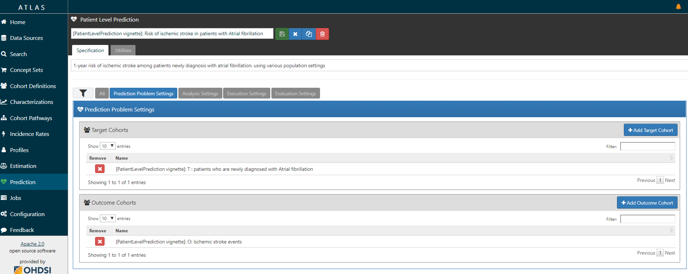</dd>
    </dl>
    
2)  <dl>
  <dt>Specify one or more analysis settings.</dt>
  <dd>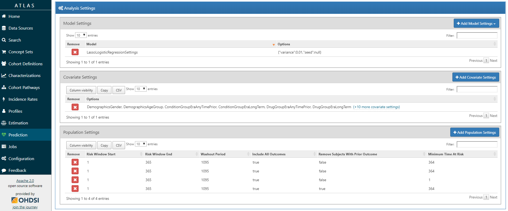</dd>
  </dl>
  \newpage
3)  <dl>
  <dt>Specify the trainings settigns</dt>
  <dd>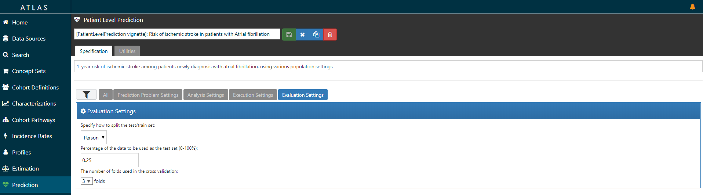</dd>
  </dl>
  
4)  <dl>
  <dt>Specify the execution settings</dt>
  <dd>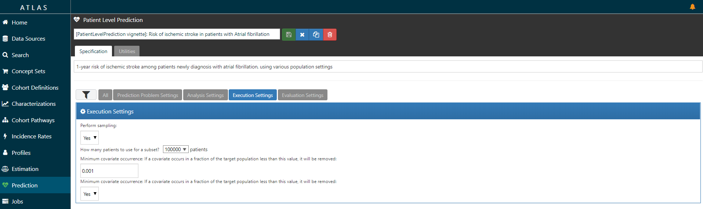</dd>
  </dl>  
  
\newpage
ATLAS can build a R package for you that will execute the full study against you CDM.
Below the steps are explained how to do this in ATLAS.

1) <dl>
  <dt>Under utilities you can find download. Click on the button to review the full study specification</dt>
  <dd>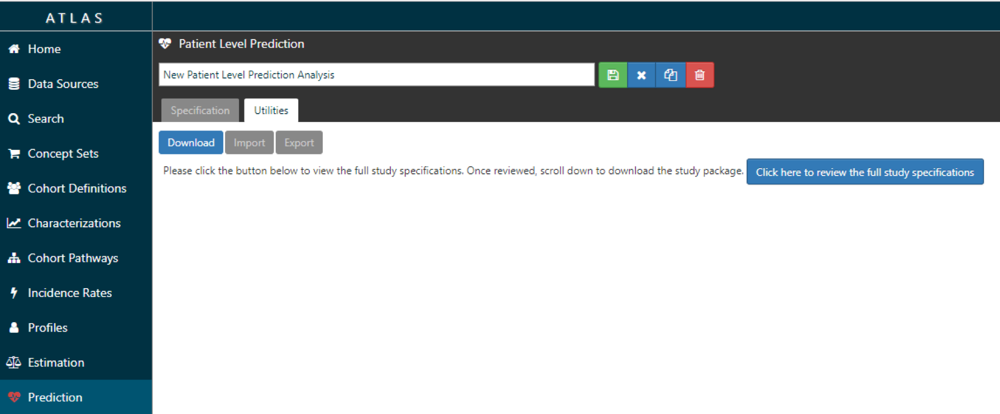</dd>
  </dl>
  
2) <dl>
  <dt>You now have to review that you indeed want to run all these analyses (cartesian product of all the settings for each T and O combination.</dt>
   <dd>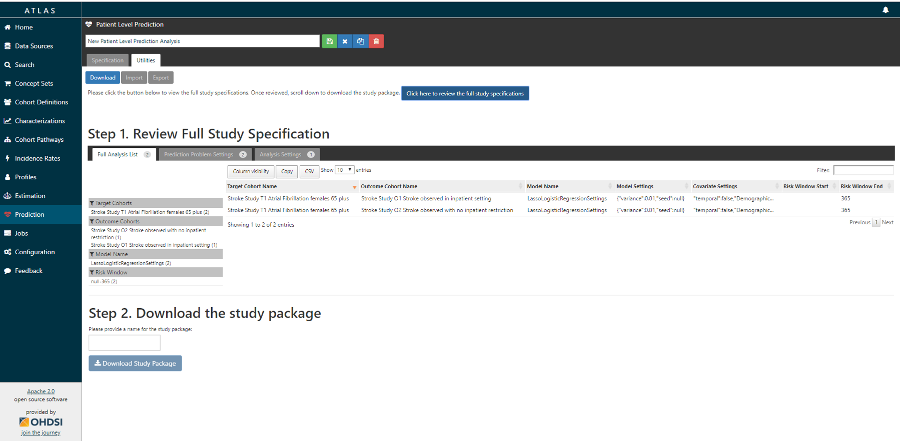</dd>
   </dl>
                                                                               
3) If you agree, you give the package a name, and download the package as a zipfile. 

4) By opening the R package in R studio and building the package you can run the study using the `execute` function. Theres is also an example CodeToRun.R script available in the extras folder of the package with extra instructions.


# Internal validation

Once we execute the study, the runPlp() function returns the trained model and the evaluation of the model on the train/test sets.

You can interactively view the results by running: `viewPlp(runPlp=lrResults)`. This will generate a Shiny App in your browser in which you can view all performance measures created by the framework as shown in the figure below.

<dd></dd>
  
  Furthermore, many interactive plots are available in the Shiny App, for example the ROC curve in which you can move over the plot to see the threshold and the corresponding sensitivity and specificity values.
<dd></dd>
  
  To generate and save all the evaluation plots to a folder run the following code:
  
```{r tidy=TRUE,eval=FALSE}
plotPlp(lrResults, dirPath=getwd())
```
The plots are described in more detail in the next sections.

\newpage
## Discrimination

The Receiver Operating Characteristics (ROC) plot shows the sensitivity against 1-specificity on the test set. The plot illustrates how well the model is able to discriminate between the people with the outcome and those without. The dashed diagonal line is the performance of a model that randomly assigns predictions. The higher the area under the ROC plot the better the discrimination of the model. The plot is created by changing the probability threshold to assign the positive class. 

<dd></dd>
  
  \newpage
## Calibration

The calibration plot shows how close the predicted risk is to the observed risk. The diagonal dashed line thus indicates a perfectly calibrated model. The ten (or fewer) dots represent the mean predicted values for each quantile plotted against the observed fraction of people in that quantile who had the outcome (observed fraction). The straight black line is the linear regression using these 10 plotted quantile mean predicted vs observed fraction points. The straight vertical lines represented the 95% lower and upper confidence intervals of the slope of the fitted line.

<dd>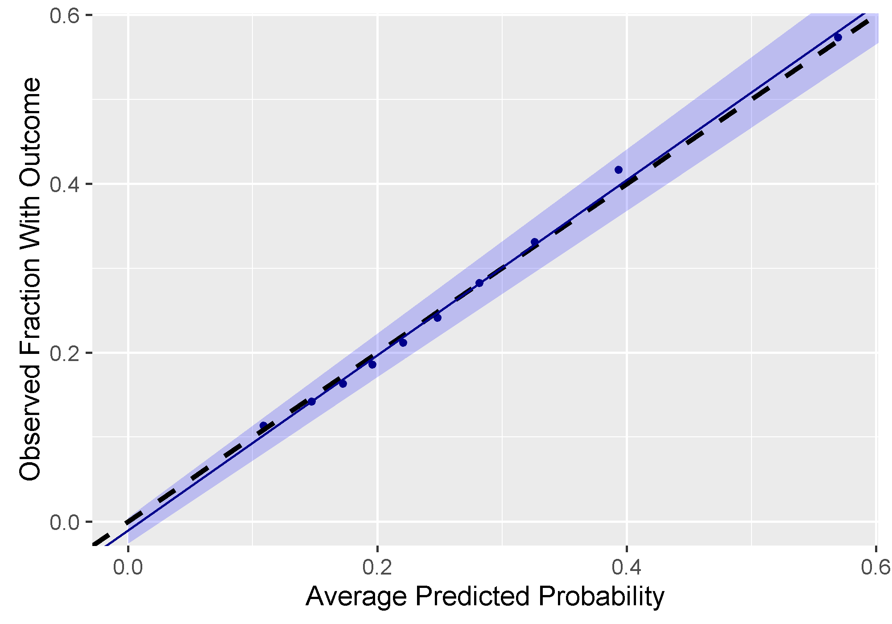</dd>
  
\newpage
## Smooth Calibration

Similar to the traditional calibration shown above the Smooth Calibration plot shows the relationship between predicted and observed risk. the major difference is that the smooth fit allows for a more fine grained examination of this. Whereas the traditional plot will be heavily influenced by the areas with the highest density of data the smooth plot will provide the same information for this region as well as a more accurate interpretation of areas with lower density. the plot also contains information on the distribution of the outcomes relative to predicted risk.

However, the increased information gain comes at a computational cost. It is recommended to use the traditional plot for examination and then to produce the smooth plot for final versions. To create the smooth calibarion plot you have to run the follow command:
  
```{r tidy=TRUE,eval=FALSE}
plotSmoothCalibration(lrResults)
```

See the help function for more information, on how to set the smoothing method etc.

The example below is from another study that better demonstrates the impact of using a smooth calibration plot. The default line fit would not highlight the miss-calibration at the lower predicted probability levels that well.

<dd></dd>
  
  \newpage
## Preference distribution

The preference distribution plots are the preference score distributions corresponding to i) people in the test set with the outcome (red) and ii) people in the test set without the outcome (blue).

<dd>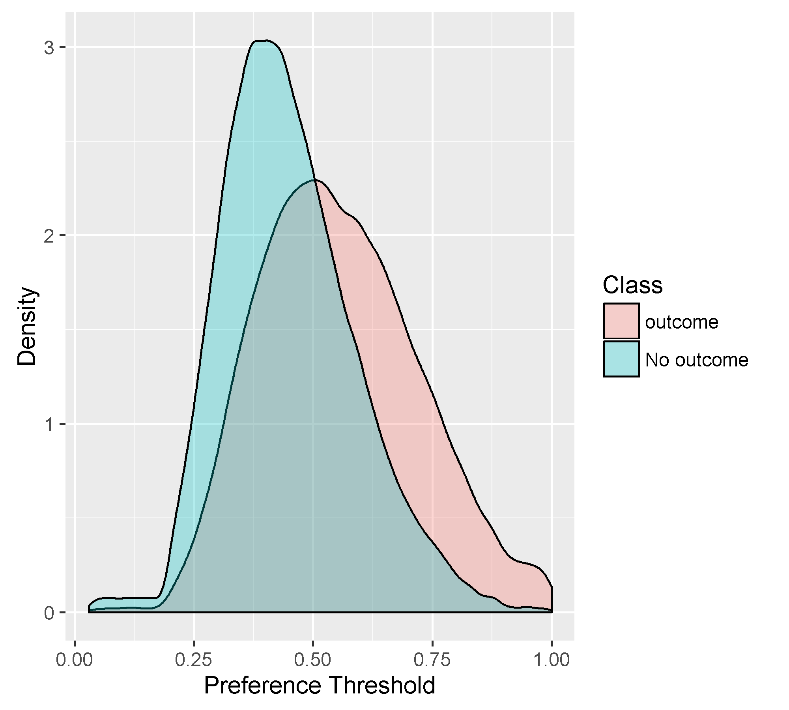</dd>
  
  \newpage
## Predicted probability distribution

The prediction distribution box plots are for the predicted risks of the people in the test set with the outcome (class 1: blue) and without the outcome (class 0: red). 

The box plots in the Figure show that the predicted probability of the outcome is indeed higher for those with the outcome but there is also overlap between the two distribution which lead to an imperfect discrimination.

<dd>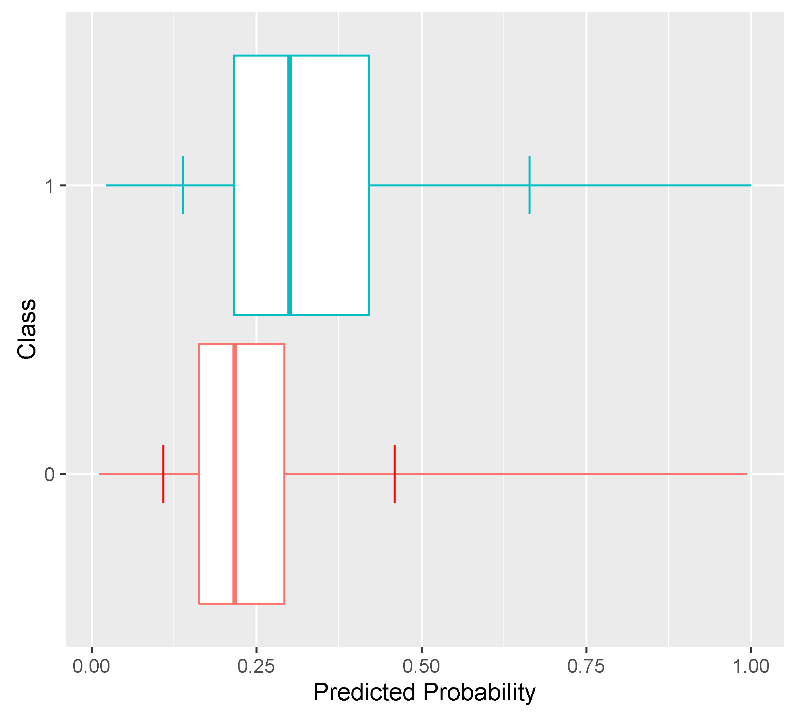</dd>
  
  \newpage
## Test-Train similarity 

The test-train similarity is assessed by plotting the mean covariate values in the train set against those in the test set for people with and without the outcome.

The results for our example of look very promising since the mean values of the covariates are on the diagonal.

<dd>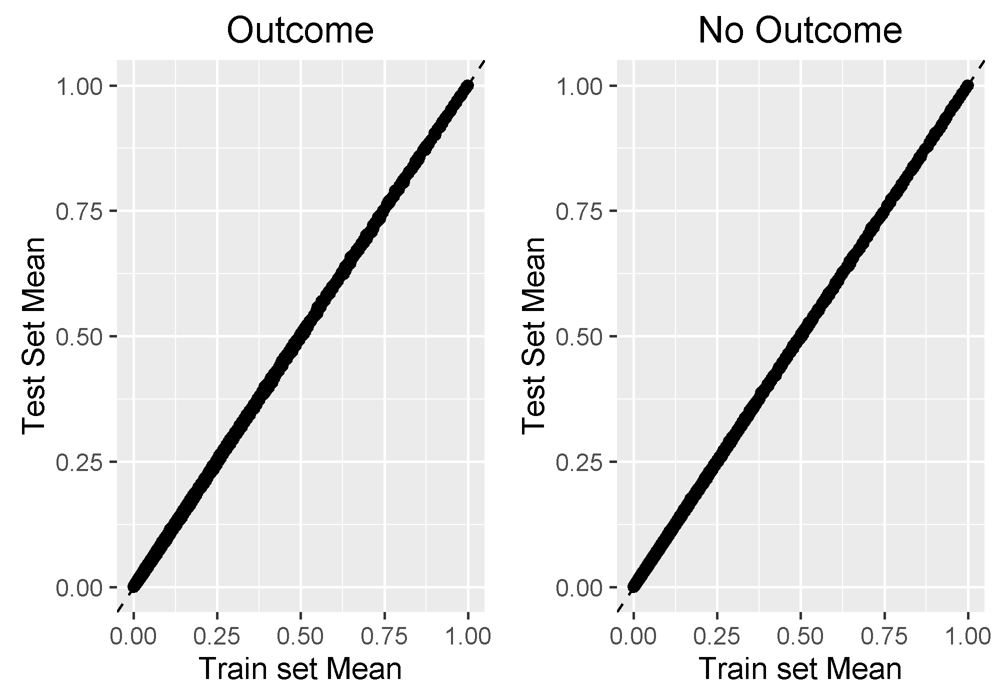</dd>
  
  \newpage
## Variable scatter plot

The variable scatter plot shows the mean covariate value for the people with the outcome against the mean covariate value for the people without the outcome. The color of the dots corresponds to the inclusion (green) or exclusion in the model (blue), respectively. It is highly recommended to use the Shiny App since this allows you to hoover over a covariate to show more details (name, value etc).

The plot shows that the mean of most of the covariates is higher for subjects with the outcome compared to those without. 

<dd>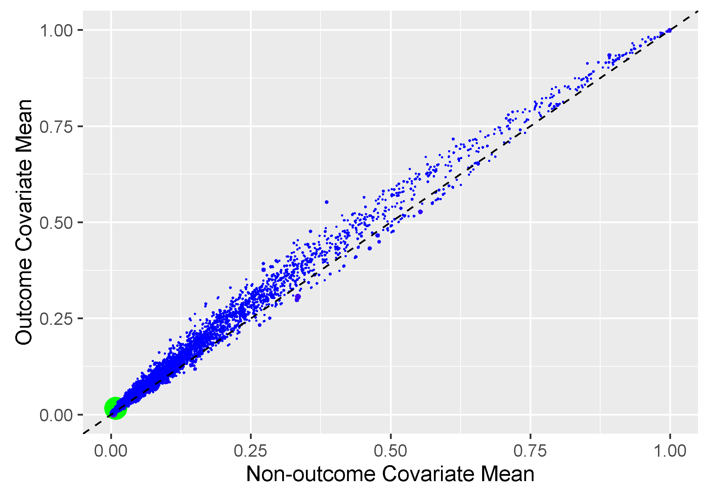</dd>
  
  \newpage
## Precision recall

Precision (P) is defined as the number of true positives (Tp) over the number of true positives plus the number of false positives (Fp).

```{r tidy=TRUE,eval=FALSE}
P <- Tp/(Tp+Fp)
```
Recall (R) is defined as the number of true positives (Tp) over the number of true positives plus the number of false negatives (Fn).
```{r tidy=TRUE,eval=FALSE}
R <- Tp/(Tp + Fn)
```
These quantities are also related to the (F1) score, which is defined as the harmonic mean of precision and recall.
```{r tidy=TRUE,eval=FALSE}
F1 <- 2*P*R/(P+R)
```
Note that the precision can either decrease or increase if the threshold is lowered.  Lowering the threshold of a classifier may increase the denominator, by increasing the number of results returned. If the threshold was previously set too high, the new results may all be true positives, which will increase precision. If the previous threshold was about right or too low, further lowering the threshold will introduce false positives, decreasing precision.

For Recall the denominator does not depend on the classifier threshold (Tp+Fn is a constant). This means that lowering the classifier threshold may increase recall, by increasing the number of true positive results. It is also possible that lowering the threshold may leave recall unchanged, while the precision fluctuates.

<dd>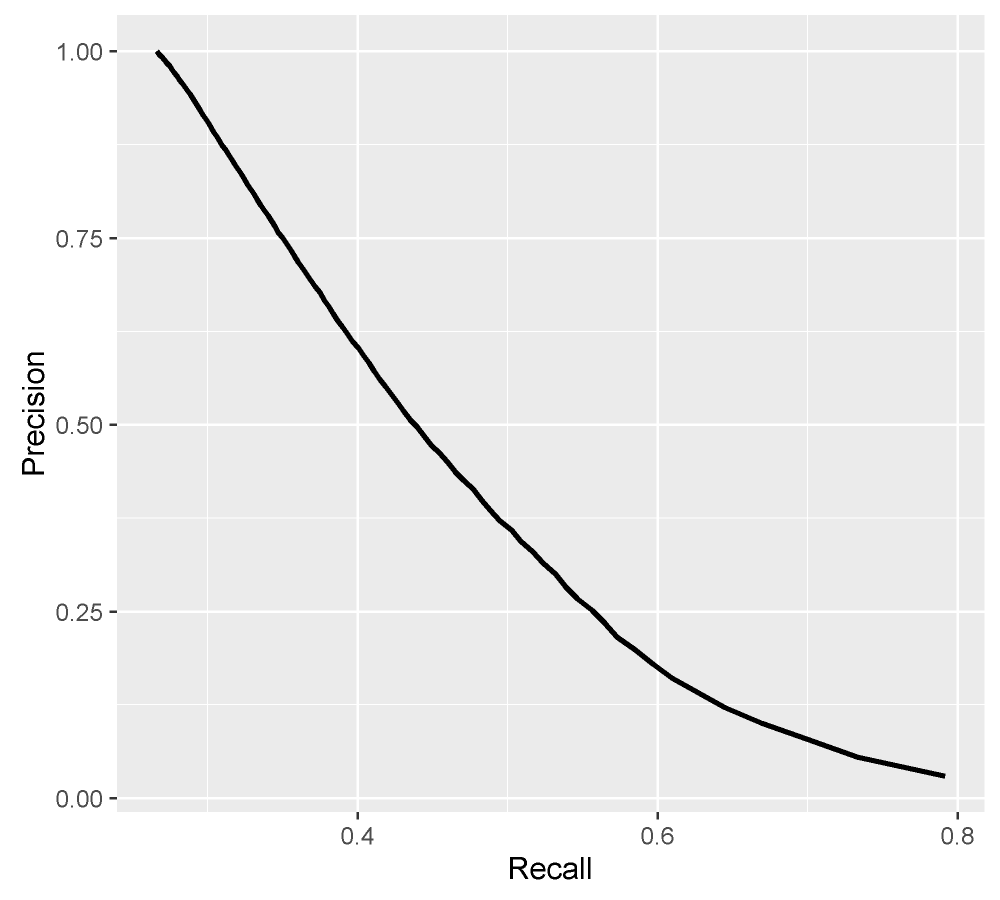</dd>
  
  \newpage
## Demographic summary 

This plot shows for females and males the expected and observed risk in different age groups together with a confidence area.

The results show that our model is well calibrated across gender and age groups.

<dd>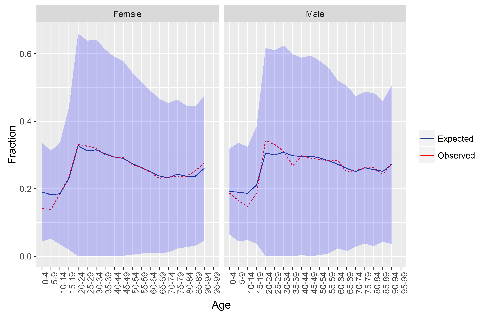</dd>
  
  
  \newpage
# External validation

We recommend to always perform external validation, i.e. apply the final model on as much new datasets as feasible and evaluate its performance.

```{r tidy=FALSE,eval=FALSE}
# load the trained model
plpModel <- loadPlpModel(getwd(),'model')

# add details of new database
validationDatabaseDetails <- createDatabaseDetails()

# to externally validate the model and perform recalibration run:
externalValidateDbPlp(
  plpModel = plpModel,
  validationDatabaseDetails = validationDatabaseDetails,
  validationRestrictPlpDataSettings = plpModel$settings$plpDataSettings,
  settings = createValidationSettings(
    recalibrate = 'weakRecalibration'
    ),
  outputFolder = getwd()
)

```

This will extract the new plpData from the specified schemas and cohort tables.  It will then apply the same population settings and the trained plp model.  Finally, it will evaluate the performance and return the standard output as `validation$performanceEvaluation` and it will also return the prediction on the population as `validation$prediction`.  They can be inserted into the shiny app for viewing the model and validation by running: `viewPlp(runPlp=plpResult, validatePlp=validation )`.


\newpage
# Other functionality

The package has much more functionality than described in this vignette and contributions have been made my many persons in the OHDSI community. The table below provides an overview:
  
  Functionality | Description | Vignette
--------------- | --------------------------------------------- | ---------------
Builing Multiple Models | This vignette describes how you can run multiple models automatically | [`Vignette`](https://github.com/OHDSI/PatientLevelPrediction/blob/main/inst/doc/BuildingMultiplePredictiveModels.pdf)
Custom Models | This vignette describes how you can add your own custom algorithms in the framework | [`Vignette`](https://github.com/OHDSI/PatientLevelPrediction/blob/main/inst/doc/AddingCustomModels.pdf)
Custom Splitting Functions | This vignette describes how you can add your own custom training/validation/testing splitting functions in the framework | [`Vignette`](https://github.com/OHDSI/PatientLevelPrediction/blob/main/inst/doc/AddingCustomSplitting.pdf)
Custom Sampling Functions | This vignette describes how you can add your own custom sampling functions in the framework | [`Vignette`](https://github.com/OHDSI/PatientLevelPrediction/blob/main/inst/doc/AddingCustomSamples.pdf)
Custom Feature Engineering/Selection | This vignette describes how you can add your own custom feature engineering and selection functions in the framework | [`Vignette`](https://github.com/OHDSI/PatientLevelPrediction/blob/main/inst/doc/AddingCustomFeatureEngineering.pdf)
Ensemble models | This vignette describes how you can use the framework to build ensemble models, i.e combine multiple models in a super learner | [`Vignette`](https://github.com/OHDSI/PatientLevelPrediction/blob/main/inst/doc/BuildingEnsembleModels.pdf)
Learning curves | Learning curves assess the effect of training set size on model performance by training a sequence of prediction models on successively larger subsets of the training set. A learning curve plot can also help in diagnosing a bias or variance problem as explained below. | [`Vignette`](https://github.com/OHDSI/PatientLevelPrediction/blob/main/inst/doc/GeneratingLearningCurves.pdf)


# Demos

We have added several demos in the package that run on simulated data:
  
``` {r eval=FALSE}
# Show all demos in our package: 
demo(package = "PatientLevelPrediction")

# For example, to run the SingleModelDemo that runs Lasso and shows you how to run the Shiny App use this call
demo("SingleModelDemo", package = "PatientLevelPrediction")
```

\newpage

# Acknowledgments

Considerable work has been dedicated to provide the `PatientLevelPrediction` package.

```{r tidy=TRUE,eval=TRUE}
citation("PatientLevelPrediction")
```

Further, `PatientLevelPrediction` makes extensive use of the `Cyclops` package.

```{r tidy=TRUE,eval=TRUE}
citation("Cyclops")
```

**Please reference this paper if you use the PLP Package in your work:**
  
  [Reps JM, Schuemie MJ, Suchard MA, Ryan PB, Rijnbeek PR. Design and implementation of a standardized framework to generate and evaluate patient-level prediction models using observational healthcare data. J Am Med Inform Assoc. 2018;25(8):969-975.](http://dx.doi.org/10.1093/jamia/ocy032)

This work is supported in part through the National Science Foundation grant IIS 1251151.

\newpage

# Appendix 1: Study population settings details {-}

In the figures below the effect is shown of the removeSubjectsWithPriorOutcome, requireTimAtRisk, and includeAllOutcomes booleans on the final study population. We start with a Target Cohort with firstExposureOnly = false and we require a washout period = 1095. We then subset the target cohort based on additional constraints. The final study population in the Venn diagrams below are colored green.

1)  <dl>
  <dt>Require minimum time-at-risk for all person in the target cohort</dt>
  <dd>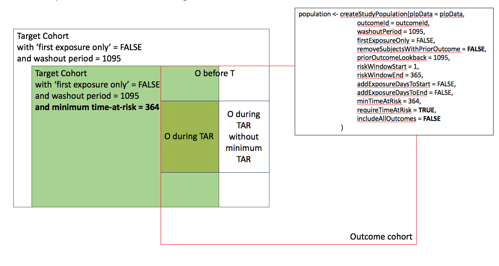</dd>
  </dl>
  
2) <dl>
  <dt>Require minumum time-at-risk for target cohort, except for persons with outcomes during time-at-risk.</dt>
  <dd>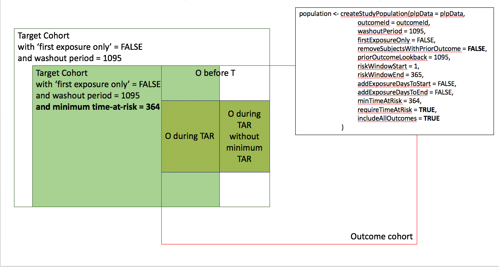</dd>
  </dl>
  
  \newpage
3) <dl>
  <dt>Include all persons in the target cohort exclude persons with prior outcomes</dt>
  <dd>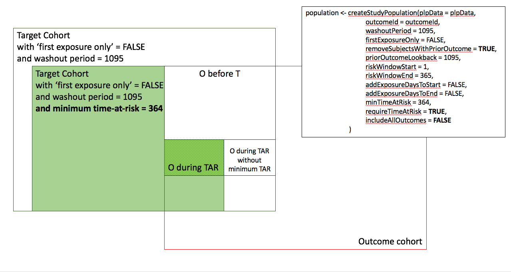</dd>
  </dl>
  
4) <dl>
  <dt>Require minimum time-at-risk for target cohort, except for persons with outcomes during time-at-risk, exclude persons with prior outcomes</dt>
  <dd>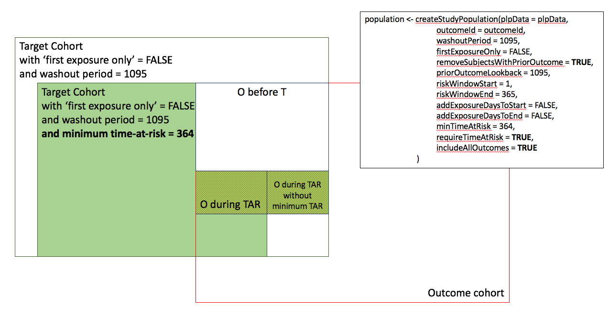</dd>
  </dl>
  
  \newpage
5) <dl>
  <dt>Include all persons in target cohort exclude persons with prior outcomes</dt>
  <dd></dd>
  </dl>
  
6) <dl>
  <dt>Include all persons in target cohort</dt>
  <dd>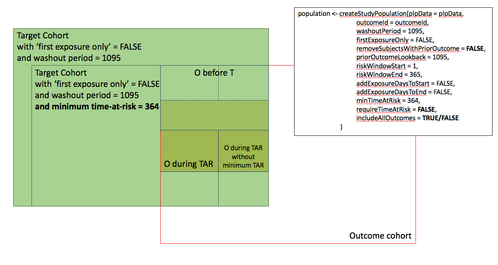</dd>
  </dl>
  
  
