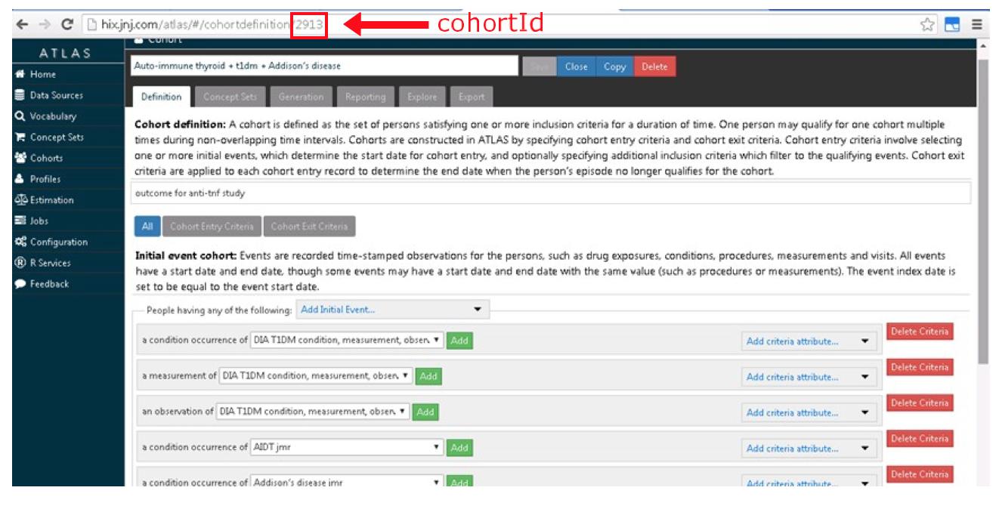

  <!--
  %\VignetteEngine{knitr}
%\VignetteIndexEntry{Building patient-level predictive models}
-->
  
  ```{r echo=FALSE,message=FALSE,warning=FALSE,eval=TRUE}
library(PatientLevelPrediction)
vignetteDataFolder <- "s:/temp/plpVignette"
# Load all needed data if it exists on this computer:
if (file.exists(vignetteDataFolder)){
  plpModel <- loadPlpModel(vignetteDataFolder,'model')
  lrResults <- loadPlpModel(file.path(vignetteDataFolder,'results'))
} 
```

```{r, echo = FALSE, message = FALSE, warning = FALSE}
library(PatientLevelPrediction)
```

# Introduction

Observational healthcare data, such as administrative claims and electronic health records, are increasingly used for clinical characterization of disease progression, quality improvement, and population-level effect estimation for medical product safety surveillance and comparative effectiveness. Advances in machine learning for large dataset analysis have led to increased interest in applying patient-level prediction on this type of data. Patient-level prediction offers the potential for medical practice to move beyond average treatment effects and to consider personalized risks as part of clinical decision-making. Many published efforts in patient-level-prediction do not follow the model development guidelines, fail to perform extensive external validation, or provide insufficient model details that limits the ability of independent researchers to reproduce the models and perform external validation. This makes it hard to fairly evaluate the predictive performance of the models and reduces the likelihood of the model being used appropriately in clinical practice. To improve standards, several papers have been written detailing guidelines for best practices in developing and reporting prediction models.

The Transparent Reporting of a multivariable prediction model for Individual Prognosis Or Diagnosis (TRIPOD) statement [(link)](https://www.equator-network.org/reporting-guidelines/tripod-statement/) provides clear recommendations for reporting prediction model development and validation5 and addresses some of the concerns related to transparency. However, data structure heterogeneity and inconsistent terminologies still make collaboration and model sharing difficult as different researchers are often required to write new code to extract the data from their databases and may define variables differently.

In our paper [(link)](https://academic.oup.com/jamia/article/25/8/969/4989437), we propose a standardised framework for patient-level prediction that utilizes the OMOP CDM and standardized vocabularies, and describe the open-source software that we developed implementing the framework’s pipeline. The framework is the first to support existing best practice guidelines and will enable open dissemination of models that can be extensively validated across the network of OHDSI collaborators.

Figure 1, illustrates the prediction problem we address. Among a population at risk, we aim to predict which patients at a defined moment in time (t = 0) will experience some outcome during a time-at-risk. Prediction is done using only information about the patients in an observation window prior to that moment in time.


As shown in Figure 2, to define a prediction problem we have to define t=0 by a Target Cohort (T), the outcome we like to predict by an outcome cohort (O), and the time at risk (TAR). Furthermore, we have to make design choices for the model we like to develop.


This framework works for all type of prediction problems, for example those presented in Figure 3. 


This vignette describes how you can use the `PatientLevelPrediction` package to build patient-level predictive models. The package enables data extraction, model building, and model evaluation using data from databases that are translated into the Observational Medical Outcomes Partnership Common Data Model (OMOP CDM). In this vignette we assume you have installed the package correctly using the [InstallationGuide](https://github.com/OHDSI/PatientLevelPrediction/blob/master/inst/doc/InstallationGuide.pdf).

To guide you through the process of model building and validation we will use the "Disease onset and progression" type as an example.

\newpage
# Definition of the Prediction Problem

Atrial fibrillation is a disease characterized by an irregular heart rate that can cause poor blood flow. Patients with atrial fibrillation are at increased risk of ischemic stroke.  Anticoagulation is a recommended prophylaxis treatment strategy for patients at high risk of stroke, though the underuse of anticoagulants and persistent severity of ischemic stroke represents a substantial unmet medical need.  Various strategies have been developed to predict risk of ischemic stroke in patients with atrial fibrillation.  CHADS2 (Gage JAMA 2001) was developed as a risk score based on history of congestive heart failure, hypertension, age>=75, diabetes and stroke.  CHADS2 was initially derived using Medicare claims data, where it achieved good discrimination (AUC=0.82).  However, subsequent external validation studies revealed the CHADS2 had substantially lower predictive accuracy (Keogh Thromb Haemost 2011).  Subsequent stroke risk calculators have been developed and evaluated, including the extension of CHADS2Vasc.  The management of atrial fibrillation has evolved substantially over the last decade, for various reasons that include the introduction of novel oral anticoagulants.  With these innovations has come a renewed interest in greater precision medicine for stroke prevention. 

We will apply the PatientLevelPrediction package to observational healthcare data to address the following patient-level prediction question:
Amongst patients who are newly diagnosed with Atrial Fibrillation, which patients will go on to have Ischemic Stroke within 3 years? 

We will define 'patients who are newly diagnosed with Atrial Fibrillation' as the first condition record of cardiac arrhythmia, which is followed by another cardiac arrhythmia condition record, at least two drug records for a drug used to treat arrhythmias, or a procedure to treat arrhythmias.  We will define 'Ischemic stroke events' as ischemic stroke condition records during an inpatient or ER visit;  successive records with > 180 day gap are considered independent episodes.

# Data extraction

The `PatientLevelPrediction` package requires longitudinal observational healthcare data in the OMOP Common Data Model format. We will now explain how to connect to the server and how the generate the Target (T=Atrial Fibrillation) and outcome cohort (O=Stroke). 

## Configuring the connection to the server

First we need to tell R how to connect to the server. `PatientLevelPrediction` uses the `DatabaseConnector` package, which provides the `createConnectionDetails` function. Type `?createConnectionDetails` for the specific settings required for the various database management systems (DBMS). For example, one might connect to a PostgreSQL database using this code:
  
```{r tidy=FALSE,eval=FALSE}
connectionDetails <- createConnectionDetails(dbms = "postgresql", 
                                             server = "localhost/ohdsi", 
                                             user = "joe", 
                                             password = "supersecret")

cdmDatabaseSchema <- "my_cdm_data"
cohortsDatabaseSchema <- "my_results"
cdmVersion <- "5"
```

The last three lines define the `cdmDatabaseSchema` and `cohortsDatabaseSchema` variables, as well as the CDM version. We will use these later to tell R where the data in CDM format live, where we want to create the cohorts of interest, and what version CDM is used. Note that for Microsoft SQL Server, databaseschemas need to specify both the database and the schema, so for example `cdmDatabaseSchema <- "my_cdm_data.dbo"`.

## Preparing the cohort and outcome of interest

First we need to define the cohort of persons for which we want to perform the prediction and we need to define the outcome we want to predict. These cohorts are provided as data in a table on the server that has the same structure as the 'cohort' table in the OMOP CDM, meaning it should have the following columns:
  
  - `cohort_definition_id`, a unique identifier for distinguishing between different types of cohorts, e.g. cohorts of interest and outcome cohorts.
- `subject_id`, a unique identifier corresponding to the `person_id` in the CDM.
- `cohort_start_date`, the start of the time period where we wish to predict the occurrence of the outcome.
- `cohort_end_date`, which can be used to determine the end of the prediction window. Can be set equal to the `cohort_start_date` for outcomes.

The observational and health data sciences & informatics (OHDSI) community has developed a tool named ATLAS which can be used to create cohorts based on inclusion criteria. We can also write custom SQL statements against the CDM. Both methods are described below.

### Cohort creation using ATLAS

!!!!! TO BE UPDATED WITH COHORT FIGURES AND TEXT OF PATRICK



ATLAS as shown in Figure 2 allows you to define cohorts interactively by specifying cohort entry and cohort exit criteria. Cohort entry criteria involce selecting one or more initial events, which determine the start date for cohort entry, and optionally specifying additional inclusion criteria which filter to the qualifying events. Cohort exit criteria are applied to each cohort entry record to determine the end date when the person's episode no longer qualifies for the cohort. For the outcome cohort the end date is less relevant. More details on the use of ATLAS can be found on the OHDSI wiki pages. 

When a cohort is created in ATLAS the cohortid is needed to extract the data in R. The cohortid can be found in the link as shown in Figure 2. 

### Custom cohort creation

!!!!! TO BE UPDATED WITH SQL AND TEXT OF PATRICK

It is also possible to create cohorts without the use of ATLAS. Using custom cohort code (SQL) you can make more advanced cohorts if needed.

For our example study, we need to create the cohort of diabetics that have been hospitalized and have a minimum amount of observation time available before and after the hospitalization. We also need to define re-hospitalizations, which we define as any hospitalizations occurring after the original hospitalization. 

For this purpose we have created a file called *HospitalizationCohorts.sql* with the following contents:

```sql
/***********************************
File HospitalizationCohorts.sql 
***********************************/
IF OBJECT_ID('@resultsDatabaseSchema.rehospitalization', 'U') IS NOT NULL
DROP TABLE @resultsDatabaseSchema.rehospitalization;

SELECT visit_occurrence.person_id AS subject_id,
MIN(visit_start_date) AS cohort_start_date,
DATEADD(DAY, @post_time, MIN(visit_start_date)) AS cohort_end_date,
1 AS cohort_definition_id
INTO @resultsDatabaseSchema.rehospitalization
FROM @cdmDatabaseSchema.visit_occurrence
INNER JOIN @cdmDatabaseSchema.observation_period
ON visit_occurrence.person_id = observation_period.person_id
INNER JOIN @cdmDatabaseSchema.condition_occurrence
ON condition_occurrence.person_id = visit_occurrence.person_id 
WHERE visit_concept_id IN (9201, 9203)
AND DATEDIFF(DAY, observation_period_start_date, visit_start_date) > @pre_time
AND visit_start_date > observation_period_start_date
AND DATEDIFF(DAY, visit_start_date, observation_period_end_date) > @post_time
AND visit_start_date < observation_period_end_date
AND DATEDIFF(DAY, condition_start_date, visit_start_date) > @pre_time
AND condition_start_date <= visit_start_date
AND condition_concept_id IN (
SELECT descendant_concept_id 
FROM @cdmDatabaseSchema.concept_ancestor 
WHERE ancestor_concept_id = 201826) /* Type 2 DM */
GROUP BY visit_occurrence.person_id;

INSERT INTO @resultsDatabaseSchema.rehospitalization
SELECT visit_occurrence.person_id AS subject_id,
visit_start_date AS cohort_start_date,
visit_end_date AS cohort_end_date,
2 AS cohort_definition_id
FROM @resultsDatabaseSchema.rehospitalization
INNER JOIN @cdmDatabaseSchema.visit_occurrence
ON visit_occurrence.person_id = rehospitalization.subject_id
WHERE visit_concept_id IN (9201, 9203)
AND visit_start_date > cohort_start_date
AND visit_start_date <= cohort_end_date
AND cohort_definition_id = 1;
```
This is parameterized SQL which can be used by the `SqlRender` package. We use parameterized SQL so we do not have to pre-specify the names of the CDM and result schemas. That way, if we want to run the SQL on a different schema, we only need to change the parameter values; we do not have to change the SQL code. By also making use of translation functionality in `SqlRender`, we can make sure the SQL code can be run in many different environments.


```{r tidy=FALSE,eval=FALSE}
library(SqlRender)
sql <- readSql("HospitalizationCohorts.sql")
sql <- renderSql(sql,
cdmDatabaseSchema = cdmDatabaseSchema,
cohortsDatabaseSchema = cohortsDatabaseSchema,
post_time = 30,
pre_time = 365)$sql
sql <- translateSql(sql, targetDialect = connectionDetails$dbms)$sql

connection <- connect(connectionDetails)
executeSql(connection, sql)
```

In this code, we first read the SQL from the file into memory. In the next line, we replace four parameter names with the actual values. We then translate the SQL into the dialect appropriate for the DBMS we already specified in the `connectionDetails`. Next, we connect to the server, and submit the rendered and translated SQL.

If all went well, we now have a table with the events of interest. We can see how many events per type:

```{r tidy=FALSE,eval=FALSE}
sql <- paste("SELECT cohort_definition_id, COUNT(*) AS count",
"FROM @cohortsDatabaseSchema.rehospitalization",
"GROUP BY cohort_definition_id")
sql <- renderSql(sql, cohortsDatabaseSchema = cohortsDatabaseSchema)$sql
sql <- translateSql(sql, targetDialect = connectionDetails$dbms)$sql

querySql(connection, sql)
```
```{r echo=FALSE,message=FALSE}
data.frame(cohort_definition_id = c(1, 2),count = c(527616, 221555))
```

## Extracting the data from the server

Now we can tell `PatientLevelPrediction` to extract all necessary data for our analysis. This is done using the `FeatureExtractionPackage` available at https://github.com/OHDSI/FeatureExtration. In short the FeatureExtractionPackage allows you to specify which features (covariates) need to be extracted, e.g. all conditions and drug exposures. It also supports the creation of custom covariates. For more detailed information on the FeatureExtraction package see its vignettes.

```{r tidy=FALSE,eval=FALSE}		   
covariateSettings <- createCovariateSettings(useDemographicsGender = TRUE,
useDemographicsAge = TRUE, useDemographicsAgeGroup = TRUE,
useDemographicsRace = TRUE, useDemographicsEthnicity = TRUE,
useConditionOccurrenceLongTerm = TRUE,
useDrugExposureLongTerm = TRUE,
useProcedureOccurrenceLongTerm = TRUE,
useMeasurementLongTerm = TRUE,
useObservationLongTerm = TRUE,
useDistinctConditionCountLongTerm =TRUE,
useVisitCountLongTerm = TRUE, 
longTermStartDays = -365,
endDays = -1)

```

The final step for extracting the data is to run the `getPlpData` function and input the connection details, the database schema where the cohorts are stored, the cohort definition ids for the cohort and outcome, and the washoutPeriod which is the minimum number of days prior to cohort index date that the person must have been observed to be included into the data, and finally input the previously constructed covariate settings. 

```{r tidy=FALSE,eval=FALSE}
plpData <- getPlpData(connectionDetails = connectionDetails,
cdmDatabaseSchema = cdmDatabaseSchema,
oracleTempSchema = oracleTempSchema,
cohortDatabaseSchema = cohortsDatabaseSchema,
cohortTable = "rehospitalization",
cohortId = 1,
washoutPeriod = 183,
covariateSettings = covariateSettings,
outcomeDatabaseSchema = cohortsDatabaseSchema,
outcomeTable = "rehospitalization",
outcomeIds = 2,
cdmVersion = cdmVersion)
```

Note that if the cohorts are created in ATLAS its corresponding cohort database schema needs to be selected. There are many additional parameters for the `getPlpData` function which are all documented in the `PatientLevelPrediction` manual. The resulting `plpData` object uses the package `ff` to store information in a way that ensures R does not run out of memory, even when the data are large. 

## Saving the data to file

Creating the `plpData` object can take considerable computing time, and it is probably a good idea to save it for future sessions. Because `plpData` uses `ff`, we cannot use R's regular save function. Instead, we'll have to use the `savePlpData()` function:

```{r tidy=TRUE,eval=FALSE}
savePlpData(plpData, "stroke_in_af_data")
```

We can use the `loadPlpData()` function to load the data in a future session.

# Applying additional inclusion criteria

To completely define the prediction problem the final study population is obtained by applying additional constraints on the two earlier defined cohorts, e.g., a minumim time at risk can be enforced (`requireTimeAtRisk, minTimeAtRisk`). In this step it is also possible to redefine the risk window based on the at-risk cohort. For example, if we like the risk window to start 30 days after the at-risk cohort start and end a year later we can set `riskWindowStart = 30` and `riskWindowEnd = 365`. In some cases the risk window needs to start at the cohort end date. This can be achieved by setting `addExposureToStart = TRUE` which adds the cohort (exposure) time to the start date.

In the example below a final population is created using an additional constraint on the washout period, removal of patients with prior outcomes in the year before, and a time at risk definition.


```{r tidy=FALSE,eval=FALSE}
population <- createStudyPopulation(plpData, 
outcomeId = 2, 
includeAllOutcomes = TRUE, 
firstExposureOnly = TRUE, 
washoutPeriod = 365, 
removeSubjectsWithPriorOutcome = TRUE, 
priorOutcomeLookback = 365,
riskWindowStart = 1,
requireTimeAtRisk = FALSE,
riskWindowEnd = 365)
```

Note that some of these constraints could also already be applied in the cohort creation step, however, the `createStudyPopulation` function allows you do sensitivity analyses more easily on the already extracted plpData from the database.

\newpage

# Model Development

## Selecting the algorithm

We see the selection of the best algorithm for a certain prediction problem as an emperical question, i.e. you need to let the data speak for itself and try different approaches to find the best. There is no algorithm that will work best for all problems (no free lunch). In our package we therefore aim to implement many algorithms. Furthermore, we made the system modular so you can add your own custom algorithms as described in more detail in the [AddingCustomAlgorithms](Link to be added) vignette. 

Our package currently contains the following algorithms:

| Algorihm | Description | Hyper-parameters |
| ----------| ---------------------------------------------------| ----------------------- |
| Regularized Logistic Regression | Lasso logistic regression belongs to the family of generalized linear models, where a linear combination of the variables is learned and finally a logistic function maps the linear combination to a value between 0 and 1.  The lasso regularization adds a cost based on model complexity to the objective function when training the model.  This cost is the sum of the absolute values of the linear combination of the coefficients.  The model automatically performs feature selection by minimizing this cost. We use the Cyclic coordinate descent for logistic, Poisson and survival analysis (Cyclops) package to perform large-scale regularized logistic regression: https://github.com/OHDSI/Cyclops | var  (starting  variance), seed |
| Gradient boosting machines | Gradient boosting machines is a boosting ensemble technique and in our framework it combines multiple decision trees.  Boosting works by iteratively adding decision trees but adds more weight to the data-points that are misclassified by prior decision trees in the cost function when training the next tree.  We use Extreme Gradient Boosting, which is an efficient implementation of the gradient boosting framework implemented in the xgboost R package available from CRAN. | ntree (number of trees), max depth (max levels in tree), min rows (minimum data points in in node), learning rate, seed  | mtry  (number  of  features  in  each  tree),ntree (number of trees), maxDepth (max levels in tree), minRows (minimum data points in in node),balance (balance class labels), seed  |
| Random forest | Random forest is a bagging ensemble technique that combines multiple decision trees.  The idea behind bagging is to reduce the likelihood of overfitting, by using weak classifiers, but combining multiple diverse weak classifiers into a strong classifier.  Random forest accomplishes this by training multiple decision trees but only using a subset of the variables in each tree and the subset of variables differ between trees. Our packages uses the sklearn learn implementation of Random Forest in python. | mtry  (number  of  features  in  each  tree),ntree (number of trees), maxDepth (max levels in tree), minRows (minimum data points in in node),balance (balance class labels), seed  |
| K-nearest neighbors | K-nearest neighbors (KNN) is an algorithm that uses some metric to find the K closest labelled data-points, given the specified metric, to a new unlabelled data-point.  The prediction of the new data-points is then the most prevalent class of the K-nearest labelled data-points.  There is a sharing limitation of KNN, as the model requires labelled data to perform the prediction on new data, and it is often not possible to share this data across data sites.We included the BigKnn classifier developed in OHDSI which is a large scale k-nearest neighbor classifier using the Lucene search engine: https://github.com/OHDSI/BigKnn | k (number   of   neighbours),weighted (weight by inverse frequency)  |
| Naive Bayes | To add  | none |
| AdaBoost | AdaBoost is a boosting ensemble technique. Boosting works by iteratively adding decision trees but adds more weight to the data-points that are misclassified by prior decision trees in the cost function when training the next tree.We use the sklearn “AdaboostClassifier” implementation in Python. | nEstimators (the maximum number of estimators at which boosting is terminated), learningRate (learning rate shrinks the contribution of each classifier by learning_rate. There is a trade-off between learningRate and nEstimators) |
| Decision Tree | A decision tree is a classifier that partitions the variable space using individual tests selected using a greedy approach.  It aims to find partitions that have the highest information gain to separate the classes.  The decision tree can easily overfit by enabling a large number of partitions (tree depth) and often needs some regularization (e.g., pruning or specifying hyper-parameters that limit the complexity of the model). We use the sklearn “DecisionTreeClassifier” implementation in Python. | maxDepth (the maximum depth of the tree), minSamplesSplit,minSamplesLeaf, minImpuritySplit (threshold for early stopping in tree growth. A node will split if its impurity is above the threshold, otherwise it is a leaf.), seed,classWeight ("Balance"" or "None") |
| Multilayer Perception | Neural networks contain multiple layers that weight their inputs using an non-linear function.  The first layer is the input layer, the last layer is the output layer the between are the hidden layers.  Neural networks are generally trained using feed forward back-propagation.  This is when you go through the network with a data-point and calculate the error between the true label and predicted label, then go backwards through the network and update the linear function weights based on the error.  This can also be performed as a batch, where multiple data-points are fee| size (the number of hidden nodes), alpha (the l2 regularisation), seed |
| Deep Learning | Deep learning such as deep nets, convolutional neural networks or recurrent neural networks are similar to a neural network but have multiple hidden layers that aim to learn latent representations useful for prediction. In the seperate BuildingDeepLearningModels vignette we describe these models and hyper-parameters in more detail |  |

In the settings function of the algorithms the user can specify a list of eligible values for each hyper-parameter. All possible combinations of the hyper-parameters are included in a so-called grid search using cross-validation on the training set. If a user does not specify any value then the default value is used instead.

For example, if we use the following settings for the gradientBoostingMachine: ntrees=c(100,200), maxDepth=4 the grid search will apply the gradient boosting machine algorithm with ntrees=100 and maxDepth=4 plus  the  default  settings  for  other  hyper-parameters  and  ntrees=200  and  maxDepth=4  plus  the  default settings  for  other  hyper-parameters.  The  hyper-parameters  that lead to the  bestcross-validation  performance will then be chosen for the final  model. For our problem we choose to build a logistic regression model with the default hyper-parameters.

```{r tidy=TRUE,eval=FALSE}
lrModel <- setLassoLogisticRegression()
```

## Model training 
The `runPlP` function uses the population, `plpData`, and model settings to train and evaluate the model. Because evaluation using the same data on which the model was built can lead to overfitting, one  uses a train-test split of the data or cross-validation. This functionaity is build in the `runPlP` function. We can use the testSplit (person/time) and testFraction parameters to split the data in a 75%-25% split and run the patient-level prediction pipeline:

```{r tidy=FALSE,eval=FALSE}
lrResults <- runPlp(population,plpData, modelSettings = lrModel, testSplit = 'person',  
testFraction = 0.25, nfold = 2)

```
Under the hood the package will now use the `Cyclops` package to fit a large-scale regularized regression using 75% of the data and will evaluate the model on the remaining 25%. A results data structure is returned containing information about the model, its performance etc.

## Saving and loading 

You can save and load the model using:

```{r tidy=TRUE,eval=FALSE}
savePlpModel(lrResults$model, dirPath = file.path(getwd(),'model'))
plpModel <- loadPlpModel(getwd(),'model')
```

You can save and load the full results structure using:

```{r tidy=TRUE,eval=FALSE}
savePlpResult(lrResults, location = file.path(getwd(),'lr'))
lrResults <- loadPlpResult(file.path(getwd(),'lr'))
```
\newpage

# Model Evaluation

The runPlp() function returns the trained model and the evaluation of the model on the train/test sets.

You can also interactively view the results by running: `viewPlp(runPlp=lrResults)`. This will generate a Shiny App in which you can view all plots and performance measure created by the framework as shown in the Figure below. 

!!! TO BE REPLACE BY SHINY APP EXAMPLE OF PATRICK


To generate and save all the evaluation plots run the following code:

```{r tidy=TRUE,eval=FALSE}
plotPlp(lrResults, dirPath=getwd())
```
The plots that are generated are described in more detail in the next sections.

\newpage
## ROC plot


The ROC plot plots the sensitivity against 1-specificity on the test set. The plot shows how well the model is able to discriminate between the people with the outcome and those without. The dashed diagonal line is the performance of a model that randomly assigns predictions. The higher the area under the ROC plot the better the discrimination of the model.  

\newpage
## Calibration plot


The calibration plot shows how close the predicted risk is to the observed risk. The diagonal dashed line thus indicates a perfectly calibrated model. The ten (or fewer) dots represent the mean predicted values for each quantile plotted against the observed fraction of people in that quantile who had the outcome (observed fraction). The straight black line is the linear regression using these 10 plotted quantile mean predicted vs observed fraction points. The two blue straight lines represented the 95% lower and upper confidence intervals of the slope of the fitted line.

\newpage
## Smooth Calibration plot


Similar to the traditional calibration shown above the Smooth Calibration plot shows the relationship between predicted and observed risk. the major difference is that the smooth fit allows for a more fine grained examination of this. Whereas the traditional plot will be heavily influenced by the areas with the highest density of data the smooth plot will provide the same information for this region as well as a more accurate interpretation of areas with lower density. the plot also contains information on the distribution of the outcomes relative to predicted risk.

However the increased information game comes at a computational cost. It is recommended to use the traditional plot for examination and then to produce the smooth plot for final versions.

\newpage
## Preference distribution plots


The preference distribution plots are the preference score distributions corresponding to i) people in the test set with the outcome (red) and ii) people in the test set without the outcome (blue).

\newpage
## Box plots


The prediction distribution boxplots are box plots for the predicted risks of the people in the test set with the outcome (class 1: blue) and without the outcome (class 0: red). 

The box plots in the Figure above show that the predicted probability of the outcome is indeed higher for those with the outcome but there is also overlap between the two distribution which lead to an imperfect discrimination.

\newpage
## Test-Train similarity plot


The test-train similarity is presented by plotting the mean covariate values in the train set against those in the test set for people with and without the outcome.

The results for our example of re-hospitalization look very promising since the mean values of the covariates are on the diagonal.

\newpage
## Variable scatter plot

The variable scatter plot shows the mean covariate value for the people with the outcome against the mean covariate value for the people without the outcome. The size and color of the dots correspond to the importance of the covariates in the trained model (size of beta) and its direction (sign of beta with green meaning positive and red meaning negative), respectivily.

The plot shows that the mean of most of the covariates is higher for subjects with the outcome compared to those without. Also there seem to be a very predictive, but rare covariate with a high beta.


\newpage
## Plot Precision Recall


Precision (P) is defined as the number of true positives (Tp) over the number of true positives plus the number of false positives (Fp).

```{r tidy=TRUE,eval=FALSE}
P <- Tp/(Tp+Fp)
```
Recall (R) is defined as the number of true positives (Tp) over the number of true positives plus the number of false negatives (Fn).
```{r tidy=TRUE,eval=FALSE}
R <- Tp/(Tp + Fn)
```
These quantities are also related to the (F1) score, which is defined as the harmonic mean of precision and recall.
```{r tidy=TRUE,eval=FALSE}
F1 <- 2*P*R/(P+R)
```
Note that the precision can either decrease or increase if the threshold is lowered.  Lowering the threshold of a classifier may increase the denominator, by increasing the number of results returned. If the threshold was previously set too high, the new results may all be true positives, which will increase precision. If the previous threshold was about right or too low, further lowering the threshold will introduce false positives, decreasing precision.

For Recall the demoninator does not depend on the classifier threshold (Tp+Fn is a constant). This means that lowering the classifier threshold may increase recall, by increasing the number of true positive results. It is also possible that lowering the threshold may leave recall unchanged, while the precision fluctuates.

\newpage
## Demographic Summary plot


This plot shows for females and males the expected and observed risk in different age groups together with a confidence area.

\newpage
# External validation

We recommend to always perform external validation, i.e. apply the final model on as much new datasets as feasible and evaluate its performance.

```{r tidy=FALSE,eval=FALSE}
# load the trained model
plpModel <- loadPlpModel(getwd(),'model')

#load the new plpData and create the population
plpData <- loadPlpData(getwd(),'data')
population <- createStudyPopulation(plpData, 
outcomeId = 2, 
includeAllOutcomes = TRUE, 
firstExposureOnly = TRUE, 
washoutPeriod = 365, 
removeSubjectsWithPriorOutcome = TRUE, 
priorOutcomeLookback = 365,
riskWindowStart = 1,
requireTimeAtRisk = FALSE,
riskWindowEnd = 365
)

# apply the trained model on the new data
validationResults <- applyModel(population,plpData,plpModel)
```

To make things easier we also provide a function for performing external validation of a model across one or multiple datasets:
```{r tidy=FALSE,eval=FALSE}
# load the trained model
plpResult <- loadPlpResult(getwd(),'plpResult')

connectionDetails <- createConnectionDetails(dbms = "postgresql", 
                                             server = "localhost/ohdsi", 
                                             user = "joe", 
                                             password = "supersecret")

validation <- externalValidatePlp(plpResult = plpResult, 
                                  connectionDetails = connectionDetails,
                                  validationSchemaTarget = 'new_cohort_schema',
                                  validationSchemaOutcome = 'new_cohort_schema',
                                  validationSchemaCdm = 'new_cdm_schema', 
                                  validationTableTarget = 'cohort_table',
                                  validationTableOutcome = 'cohort_table', 
                                  validationIdTarget = 'cohort_id', 
                                  validationIdOutcome = 'outcome_id', 
                                  keepPrediction = T
                                  )

```
This will extract the new plpData from the specified schemas and cohort tables.  It will then apply the same population settings and the trained plp model.  Finally, it will evaluate the performance and return the standard output as `validation$performance` and if keepPrediction is TRUE then it will also return the prediction on the population as `validation$prediction`.  They can be inserted into the shiny app for viewing the model and validation by running: `viewPlp(runPlp=plpResult, validatePlp=validation )`.

If you want to validate on multiple databases available you can insert the new schemas and cohort tables as a list:
```{r tidy=FALSE,eval=FALSE}
# load the trained model
plpResult <- loadPlpResult(getwd(),'plpResult')

connectionDetails <- createConnectionDetails(dbms = "postgresql", 
                                             server = "localhost/ohdsi", 
                                             user = "joe", 
                                             password = "supersecret")

validation <- externalValidatePlp(plpResult = plpResult, 
                                  connectionDetails = connectionDetails,
                                  validationSchemaTarget = list('new_cohort_schema1',
                                                                'new_cohort_schema2'),
                                  validationSchemaOutcome = list('new_cohort_schema1',
                                                                 'new_cohort_schema2'),
                                  validationSchemaCdm = list('new_cdm_schema1',
                                                             'new_cdm_schema2'), 
                                  validationTableTarget = list('new_cohort_table1',
                                                               'new_cohort_table2'),
                                  validationTableOutcome = list('new_cohort_table1',
                                                                'new_cohort_table2'),
                                  validationIdTarget = 'cohort_id', 
                                  validationIdOutcome = 'outcome_id', 
                                  keepPrediction = T
                                  )

```
# Demos

We have added several demos in the package that run on simulated data:

``` {r eval=FALSE}
# Show all demos in our package: 
 demo(package = "PatientLevelPrediction")

# To run the SingleModelDemo for example use this call
 demo("SingleModelDemo", package = "PatientLevelPrediction")
```
\newpage

# Acknowledgments

Considerable work has been dedicated to provide the `PatientLevelPrediction` package.

```{r tidy=TRUE,eval=TRUE}
citation("PatientLevelPrediction")
```

Further, `PatientLevelPrediction` makes extensive use of the `Cyclops` package.

```{r tidy=TRUE,eval=TRUE}
citation("Cyclops")
```

**Please reference this paper if you use the PLP Package in your work:**

[Reps JM, Schuemie MJ, Suchard MA, Ryan PB, Rijnbeek PR. Design and implementation of a standardized framework to generate and evaluate patient-level prediction models using observational healthcare data. J Am Med Inform Assoc. 2018;25(8):969-975.](http://dx.doi.org/10.1093/jamia/ocy032)

This work is supported in part through the National Science Foundation grant IIS 1251151.
