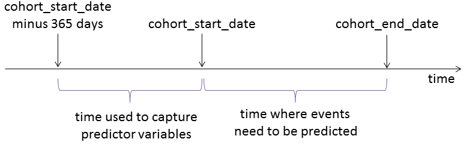

<!--
%\VignetteEngine{knitr}
%\VignetteIndexEntry{Building patient-level predictive models}
-->

```{r echo=FALSE,message=FALSE,warning=FALSE,eval=TRUE}
library(PatientLevelPrediction)
# Load all needed data if it exists on this computer:
if (file.exists("s:/temp/PlpVignette")){
  plpData <- loadPlpData("s:/temp/PlpVignette/plpData")
  parts <- list()
  parts[[2]] <- loadPlpData("s:/temp/PlpVignette/plpData_Test")
  model <- readRDS("s:/temp/PlpVignette/model.rds")
  prediction <- readRDS(file = "s:/temp/PlpVignette/prediction.rds")
  means <- readRDS(file = "s:/temp/PlpVignette/means.rds")
} 
```

```{r, echo = FALSE, message = FALSE, warning = FALSE}
library(PatientLevelPrediction)
```
# Introduction

This vignette describes how you can use the `PatientLevelPrediction` package to build patient-level prediction models. We will walk through all the steps needed to build an exemplar model, and we have selected the well-studied topic of predicting re-hospitalization. To reduce the scope a bit, we have limited ourselves to a diabetes type 2 population.

## Specifying the cohort of interest and outcomes

The `PatientLevelPrediction` package requires longitudinal observational healthcare data in the OMOP Common Data Model format. The user will need to specify two things: 

1. Time periods for which we wish to predict the occurrence of an outcome. We will call this the **cohort of interest** or cohort for short. One person can have multiple time periods, but time periods should not overlap.
2. Outcomes for which we wish to build a predictive model.

The cohort and outcomes should be provided as data in a table on the server, where the table should have the same structure as the cohort table in the OMOP CDM, meaning it should have the following columns:

- `cohort_concept_id` (CDM v4) or `cohort_concept_id` (CDM v5+), a unique identifier for distinguishing between different types of cohorts, e.g. cohorts of interest and outcome cohorts.
- `subject_id`, a unique identifier corresponding to the `person_id` in the CDM.
- `cohort_start_date`, the start of the time period where we wish to predict the occurrence of the outcome.
- `cohort_end_date`, which can be used to determine the end of the prediction window. Can be NULL for outcomes.



The prediction window always starts on the `cohort_start_date`. When the `useCohortEndDate` argument is set to `TRUE`, the prediction window will end on the `cohort_end_date` plus the number of days specified using the `windowPersistence` argument. If the `useCohortEndDate` argument is set to `FALSE`, the prediction window will end on the `cohort_start_date` plus the number of days specified using the `windowPersistence` argument.

The package will use data from the time period preceding (and including) the `cohort_start_date` to build a large set of features that can be used to predict outcomes during the prediction window (including the first and last day of the prediction window). These features can include binary indicators for the occurrence of any individual drug, condition, procedures, as well as demographics and comorbidity indices. 

**Important**: Since the `cohort_start_date` is included in both the time used to construct predictors, and the time when outcomes can occurr, it is up to the user to either remove outcomes occurring on the `cohort_start_date`, or to remove predictors that are in fact indicators of the occurrence of an outcome on the `cohort_start_date`.

# Installation instructions

Before installing the `PatientLevelPrediction` package make sure you have Java available.  Java can be downloaded from [www.java.com](http://www.java.com). For Windows users, RTools is also necessary.  RTools can be downloaded from [CRAN](http://cran.r-project.org/bin/windows/Rtools/).

The `PatientLevelPrediction` package is currently maintained in a [Github repository](https://github.com/OHDSI/PatientLevelPrediction), and has dependencies on other packages in Github. All of these packages can be downloaded and installed from within R using the `devtools` package:

```{r tidy=TRUE,eval=FALSE}
install.packages("devtools")
library(devtools)
install_github("ohdsi/SqlRender") 
install_github("ohdsi/DatabaseConnector") 
install_github("ohdsi/OhdsiRTools") 
install_github("ohdsi/Cyclops") 
install_github("ohdsi/PatientLevelPrediction") 
```

Once installed, you can type `library(PatientLevelPrediction)` to load the package.

# Data extraction

The first step in running the `PatientLevelPrediction` is extracting all necessary data from the database server holding the data in the Common Data Model (CDM) format.

## Configuring the connection to the server

We need to tell R how to connect to the server where the data are. `PatientLevelPrediction` uses the `DatabaseConnector` package, which provides the `createConnectionDetails` function. Type `?createConnectionDetails` for the specific settings required for the various database management systems (DBMS). For example, one might connect to a PostgreSQL database using this code:

```{r tidy=FALSE,eval=FALSE}
connectionDetails <- createConnectionDetails(dbms = "postgresql", 
                                             server = "localhost/ohdsi", 
                                             user = "joe", 
                                             password = "supersecret")

cdmDatabaseSchema <- "my_cdm_data"
cohortsDatabaseSchema <- "my_results"
cdmVersion <- "4"
```

The last three lines define the `cdmDatabaseSchema` and `cohortsDatabaseSchema` variables,as well as the CDM version. We'll use these later to tell R where the data in CDM format live, where we want to create the cohorts of interest, and what version CDM is used. Note that for Microsoft SQL Server, databaseschemas need to specify both the database and the schema, so for example `cdmDatabaseSchema <- "my_cdm_data.dbo"`.

## Preparing the cohort and outcome of interest

Before we can start using the `PatientLevelPrediction` package itself, we need to construct a cohort of interest for which we want to perform the prediction, and the outcome, the event that we would like to predict. We do this by writing SQL statements against the CDM that populate a table containing the persons and events of interest. The resulting table should have the same structure as the `cohort` table in the CDM. For CDM v4, this means it should have the fields `cohort_concept_id`, `cohort_start_date`, `cohort_end_date`,and `subject_id`. For CDM v4, the `cohort_concept_id` field must be called `cohort_definition_id`. 

For our example study, we need to create the cohort of diabetics that have been hospitalized and have a minimum amount of observation time available before and after the hospitalization. We also need to defined re-hospitalizations, which we define as any hospitalizations occurring after the original hospitalization. 

For this purpose we have created a file called *HospitalizationCohorts.sql* with the following contents:

```sql
/***********************************
File HospitalizationCohorts.sql 
***********************************/
IF OBJECT_ID('@cohortsDatabaseSchema.rehospitalization', 'U') IS NOT NULL
DROP TABLE @cohortsDatabaseSchema.rehospitalization;

SELECT visit_occurrence.person_id AS subject_id,
MIN(visit_start_date) AS cohort_start_date,
DATEADD(DAY, @post_time, MIN(visit_start_date)) AS cohort_end_date,
1 AS cohort_concept_id
INTO @cohortsDatabaseSchema.rehospitalization
FROM @cdmDatabaseSchema.visit_occurrence
INNER JOIN @cdmDatabaseSchema.observation_period
ON visit_occurrence.person_id = observation_period.person_id
INNER JOIN @cdmDatabaseSchema.condition_occurrence
ON condition_occurrence.person_id = visit_occurrence.person_id 
WHERE place_of_service_concept_id IN (9201, 9203)
AND DATEDIFF(DAY, observation_period_start_date, visit_start_date) > @pre_time
AND visit_start_date > observation_period_start_date
AND DATEDIFF(DAY, visit_start_date, observation_period_end_date) > @post_time
AND visit_start_date < observation_period_end_date
AND DATEDIFF(DAY, condition_start_date, visit_start_date) > @pre_time
AND condition_start_date <= visit_start_date
AND condition_concept_id IN (
SELECT descendant_concept_id 
FROM @cdmDatabaseSchema.concept_ancestor 
WHERE ancestor_concept_id = 201826) /* Type 2 DM */
GROUP BY visit_occurrence.person_id;

INSERT INTO @cohortsDatabaseSchema.rehospitalization
SELECT visit_occurrence.person_id AS subject_id,
visit_start_date AS cohort_start_date,
visit_end_date AS cohort_end_date,
2 AS cohort_concept_id
FROM @cohortsDatabaseSchema.rehospitalization
INNER JOIN @cdmDatabaseSchema.visit_occurrence
ON visit_occurrence.person_id = rehospitalization.subject_id
WHERE place_of_service_concept_id IN (9201, 9203)
AND visit_start_date > cohort_start_date
AND visit_start_date <= cohort_end_date
AND cohort_concept_id = 1;
```

This is parameterized SQL which can be used by the `SqlRender` package. We use parameterized SQL so we do not have to pre-specify the names of the CDM and result schemas. That way, if we want to run the SQL on a different schema, we only need to change the parameter values; we do not have to change the SQL code. By also making use of translation functionality in `SqlRender`, we can make sure the SQL code can be run in many different environments.


```{r tidy=FALSE,eval=FALSE}
library(SqlRender)
sql <- readSql("HospitalizationCohorts.sql")
sql <- renderSql(sql,
                 cdmDatabaseSchema = cdmDatabaseSchema,
                 cohortsDatabaseSchema = cohortsDatabaseSchema,
                 post_time = 30,
                 pre_time = 365)
)$sql
sql <- translateSql(sql, targetDialect = connectionDetails$dbms)$sql

connection <- connect(connectionDetails)
executeSql(connection, sql)
```

In this code, we first read the SQL from the file into memory. In the next line, we replace four parameter names with the actual values. We then translate the SQL into the dialect appropriate for the DBMS we already specified in the `connectionDetails`. Next, we connect to the server, and submit the rendered and translated SQL.

If all went well, we now have a table with the events of interest. We can see how many events per type:

```{r tidy=FALSE,eval=FALSE}
sql <- paste("SELECT cohort_concept_id, COUNT(*) AS count",
             "FROM @cohortsDatabaseSchema.rehospitalization",
             "GROUP BY cohort_concept_id")
sql <- renderSql(sql, cohortsDatabaseSchema = cohortsDatabaseSchema)$sql
sql <- translateSql(sql, targetDialect = connectionDetails$dbms)$sql

querySql(connection, sql)
```
```{r echo=FALSE,message=FALSE}
data.frame(cohort_concept_id = c(1, 2),count=c(395910, 165350))
```

## Extracting the data from the server

Now we can tell `PatientLevelPrediction` to extract all necessary data for our analysis:

```{r tidy=FALSE,eval=FALSE}		   
covariateSettings <- createCovariateSettings(useCovariateDemographics = TRUE,
                                             useCovariateConditionOccurrence = TRUE,
                                             useCovariateConditionOccurrence365d = TRUE,
                                             useCovariateConditionOccurrence30d = TRUE,
                                             useCovariateConditionOccurrenceInpt180d = TRUE,
                                             useCovariateConditionEra = TRUE,
                                             useCovariateConditionEraEver = TRUE,
                                             useCovariateConditionEraOverlap = TRUE,
                                             useCovariateConditionGroup = TRUE,
                                             useCovariateDrugExposure = TRUE,
                                             useCovariateDrugExposure365d = TRUE,
                                             useCovariateDrugExposure30d = TRUE,
                                             useCovariateDrugEra = TRUE,
                                             useCovariateDrugEra365d = TRUE,
                                             useCovariateDrugEra30d = TRUE,
                                             useCovariateDrugEraOverlap = TRUE,
                                             useCovariateDrugEraEver = TRUE,
                                             useCovariateDrugGroup = TRUE,
                                             useCovariateProcedureOccurrence = TRUE,
                                             useCovariateProcedureOccurrence365d = TRUE,
                                             useCovariateProcedureOccurrence30d = TRUE,
                                             useCovariateProcedureGroup = TRUE,
                                             useCovariateObservation = TRUE,
                                             useCovariateObservation365d = TRUE,
                                             useCovariateObservation30d = TRUE,
                                             useCovariateObservationCount365d = TRUE,
                                             useCovariateMeasurement = TRUE,
                                             useCovariateMeasurement365d = TRUE,
                                             useCovariateMeasurement30d = TRUE,
                                             useCovariateMeasurementCount365d = TRUE,
                                             useCovariateMeasurementBelow = TRUE,
                                             useCovariateMeasurementAbove = TRUE,
                                             useCovariateConceptCounts = TRUE,
                                             useCovariateRiskScores = TRUE,
                                             useCovariateRiskScoresCharlson = TRUE,
                                             useCovariateRiskScoresDCSI = TRUE,
                                             useCovariateRiskScoresCHADS2 = TRUE,
                                             useCovariateRiskScoresCHADS2VASc = TRUE,
                                             useCovariateInteractionYear = FALSE,
                                             useCovariateInteractionMonth = FALSE,
                                             excludedCovariateConceptIds = c(),
                                             deleteCovariatesSmallCount = 100)

plpData <- getDbPlpData(connectionDetails = connectionDetails,
			  cdmDatabaseSchema = cdmDatabaseSchema,
			  oracleTempSchema = oracleTempSchema,
			  cohortDatabaseSchema = cohortsDatabaseSchema,
			  cohortTable = "rehospitalization",
			  cohortIds = 1,
			  washoutWindow = 183,
			  useCohortEndDate = TRUE,
			  windowPersistence = 0,
			  covariateSettings = covariateSettings,
			  outcomeDatabaseSchema = cohortsDatabaseSchema,
			  outcomeTable = "rehospitalization",
			  outcomeIds = 2,
			  firstOutcomeOnly = FALSE, 
			  cdmVersion = cdmVersion)
```

There are many parameters, but they are all documented in the `PatientLevelPrediction` manual. In short, we are using the `getDbPlpData` to get all data on the cohort of interest, outcomes and covariates from the database. The resulting `plpData` object uses the package `ff` to store information in a way that ensures R does not run out of memory, even when the data are large. 

We can get some overall statistics using the generic `summary()` method:

```{r tidy=FALSE,eval=FALSE}
summary(plpData)
```
```{r echo=FALSE,message=FALSE,eval=TRUE}
if (file.exists("s:/temp/PlpVignette")){
  summary(plpData)
}
```

### Saving the data to file

Creating the `plpData` object can take considerable computing time, and it is probably a good idea to save it for future sessions. Because `plpData` uses `ff`, we cannot use R's regular save function. Instead, we'll have to use the `savePlpData()` function:

```{r tidy=TRUE,eval=FALSE}
savePlpData(plpData, "rehosp_plp_data")
```

We can use the `loadPlpData()` function to load the data in a future session.

# Fitting the model

## Train-test split

We typically not only want to build our model, we also want to know how good it is. Because evaluation using the same data on which the model was fitted can lead to overestimation, one  uses a train-test split of the data or cross-validation. We can use the `splitData()` function to split the data in a 75%-25% split:

```{r tidy=TRUE,eval=FALSE}
parts <- splitData(plpData, c(0.75,0.25))
```

The `parts` variable is a list of `plpData` objects.

We can now fit the model on the first part of the data (the training set):

## Fitting the model on the training data

```{r tidy=TRUE,eval=FALSE}
model <- fitPredictiveModel(parts[[1]], modelType = "logistic")
```

The `fitPredictiveModel()` function uses the `Cyclops` package to fit a large-scale regularized regression. To fit the model, `Cyclops` needs to know the hyperparameter value which specifies the variance of the prior. By default `Cyclops` will use cross-validation to estimate the optimal hyperparameter. However, be aware that this can take a really long time. You can use the `prior` and `control` parameters of the `fitPredictiveModel()` to specify `Cyclops` behaviour, including using multiple CPUs to speed-up the cross-validation. 

## Model evaluation

We can evaluate how well the model is able to predict the outcome, for example on the test data we can compute the area under the ROC curve:

```{r tidy=TRUE,eval=FALSE}
prediction <- predictProbabilities(model, parts[[2]])
computeAuc(prediction, parts[[2]])
```
```{r echo=FALSE,message=FALSE}
if (file.exists("s:/temp/PlpVignette")){
  computeAuc(prediction, parts[[2]])
}
```

And we can plot the ROC curve itself:

```{r tidy=TRUE,eval=FALSE}
plotRoc(prediction, parts[[2]])
```
```{r echo=FALSE,message=FALSE}
if (file.exists("s:/temp/PlpVignette")){
  plotRoc(prediction, parts[[2]])
}
```

We can also look at the calibration:

```{r tidy=TRUE,eval=FALSE}
plotCalibration(prediction, parts[[2]], numberOfStrata = 10)
```
```{r echo=FALSE,message=FALSE}
if (file.exists("s:/temp/PlpVignette")){
  plotCalibration(prediction, parts[[2]], numberOfStrata = 10)
}
```

## Inspecting the model

Now that we have some idea of the operating characteristics of our predictive model, we can investigate the model itself: 

```{r tidy=TRUE,eval=FALSE}
modelDetails <- getModelDetails(model, plpData)
head(modelDetails)
```
```{r echo=FALSE,message=FALSE}
if (file.exists("s:/temp/PlpVignette")){
  modelDetails <- getModelDetails(model, parts[[2]])
  truncRight <- function(x, n){
    nc <- nchar(x)
    x[nc > (n-3)] <- paste('...',substr(x[nc > (n-3)], nc[nc > (n-3)]-n+1, nc[nc > (n-3)]),sep="")
    x
  }
  modelDetails$covariateName <- truncRight(as.character(modelDetails$covariateName),35)
  head(modelDetails)  
}
```

This shows the strongest predictors in the model with their corresponding betas.

# Acknowledgments

Considerable work has been dedicated to provide the `PatientLevelPrediction` package.

```{r tidy=TRUE,evale=TRUE}
citation("PatientLevelPrediction")
```

Further, `PatientLevelPrediction` makes extensive use of the `Cyclops` package.

```{r tidy=TRUE,evale=TRUE}
citation("Cyclops")
```

This work is supported in part through the National Science Foundation grant IIS 1251151.


