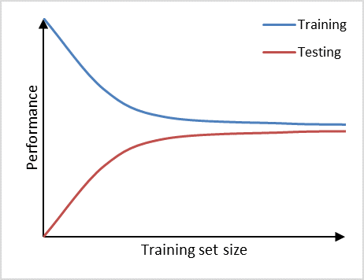
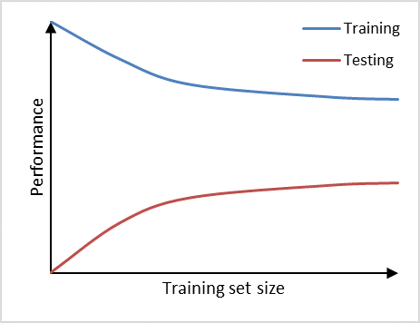
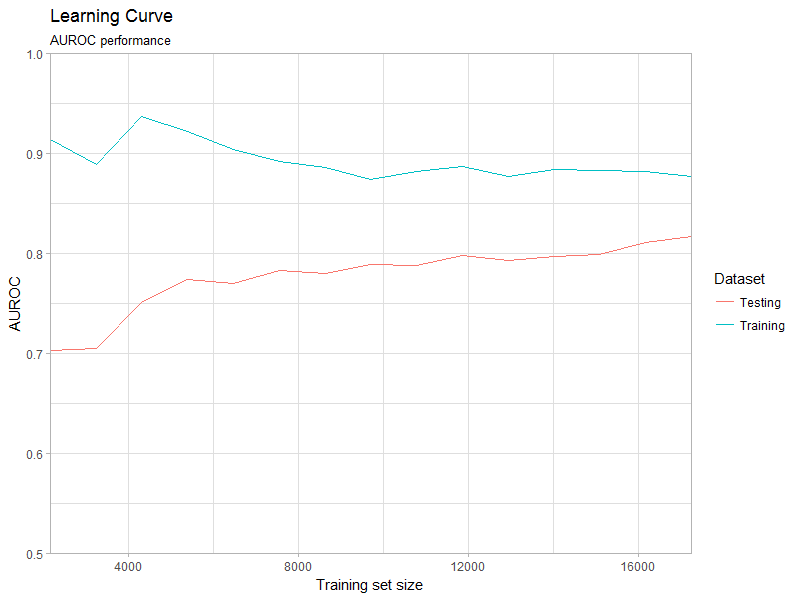

<!--
%\VignetteEngine{knitr}
%\VignetteIndexEntry{Creating Learning Curves}
-->


```{r setup, include=FALSE}
knitr::opts_chunk$set(echo = TRUE)
```

```{r, eval=FALSE, echo = FALSE, message = FALSE, warning = FALSE}
library(PatientLevelPrediction)
vignetteDataFolder <- "s:/temp/plpVignette"
# Load all needed data if it exists on this computer:
if (file.exists(vignetteDataFolder)){
  plpModel <- loadPlpModel(vignetteDataFolder,'model')
  lrResults <- loadPlpModel(file.path(vignetteDataFolder,'results'))
}
```

# Introduction

This vignette describes how you can use the Observational Health Data Sciences and Informatics (OHDSI) [`PatientLevelPrediction`](http://github.com/OHDSI/PatientLevelPrediction) package to create learning curves. This vignette assumes you have read and are comfortable with building patient level prediction models as described in the  [`BuildingPredictiveModels` vignette](https://github.com/OHDSI/PatientLevelPrediction/blob/main/inst/doc/BuildingPredictiveModels.pdf).

Prediction models will show overly-optimistic performance when predicting on the same data as used for training. Therefore, best-practice is to partition our data into a training set and testing set. We then train our prediction model on the training set portion and asses its ability to generalize to unseen data by measuring its performance on the testing set.

Learning curves assess the effect of training set size on model performance by training a sequence of prediction models on successively larger subsets of the training set. A learning curve plot can also help in diagnosing a bias or variance problem as explained below.



Figure 1, shows an example of learning curve plot in which the vertical axis represents the model performance and the horizontal axis the training set size. If training set size is small, the performance on the training set is high, because a model can often be fitted well to a limited number of training examples. At the same time, the performance on the testing set will be poor, because the model trained on such a limited number of training examples will not generalize well to unseen data in the testing set. As the training set size increases, the performance of the model on the training set will decrease. It becomes more difficult for the model to find a good fit through all the training examples. Also, the model will be trained on a more representative portion of training examples, making it generalize better to unseen data. This can be observed by the increasin testing set performance.

The learning curve can help us in diagnosing bias and variance problems with our classifier which will provide guidance on how to further improve our model. We can observe high variance (overfitting) in a prediction model if it performs well on the training set, but poorly on the testing set (Figure 2). Adding additional data is a common approach to counteract high variance. From the learning curve it becomes apparent, that adding additional data may improve performance on the testing set a little further, as the learning curve has not yet plateaued and, thus, the model is not saturated yet. Therefore, adding more data will decrease the gap between training set and testing set, which is the main indicator for a high variance problem. 




Furthermore, we can observe high bias (underfitting) if a prediction model performs poorly on the training set as well as on the testing set (Figure 3). The learning curves of training set and testing set have flattened on a low performance with only a small gap in between them. Adding additional data will in this case have little to no impact on the model performance. Choosing another prediction algorithm that can find more complex (for example non-linear) relationships in the data may be an alternative approach to consider in this high bias situation.


# Creating the learning curve

Use the [`PatientLevelPrediction`](http://github.com/OHDSI/PatientLevelPrediction) package to create a `plpData` object . Alternatively, you can make use of the data simulator. The following code snippet creates data for 12000 patients.

```{r eval=FALSE}
set.seed(1234)
data(plpDataSimulationProfile)
sampleSize <- 12000
plpData <- simulatePlpData(
  plpDataSimulationProfile,
  n = sampleSize
)

```

Specify the population settings (this does additional exclusions such as requiring minimum prior observation or no prior outcome as well as specifying the time-at-risk period to enable labels to be created):

```{r eval=FALSE}
populationSettings <- createStudyPopulationSettings(
  binary = TRUE,
  firstExposureOnly = FALSE,
  washoutPeriod = 0,
  removeSubjectsWithPriorOutcome = FALSE,
  priorOutcomeLookback = 99999,
  requireTimeAtRisk = FALSE,
  minTimeAtRisk = 0,
  riskWindowStart = 0,
  riskWindowEnd = 365,
  verbosity = "INFO"
)
```

Specify the prediction algorithm to be used.

```{r eval=FALSE}
# Use LASSO logistic regression
modelSettings <- setLassoLogisticRegression()

```

Specify the split settings and a sequence of training set fractions (these over ride the splitSetting trainFraction). Alternatively, instead of `trainFractions`,  you can provide a sequence of training events (`trainEvents`) instead of the training set fractions. This is recommended, because our research has shown that number of events is the important determinant of model performance. Make sure that your training set contains the number of events specified.

```{r eval = FALSE}

splitSettings = createDefaultSplitSetting(
  testFraction = 0.2,  
  type = 'stratified',
  splitSeed = 1000
  )

trainFractions <- seq(0.1, 0.8, 0.1) # Create eight training set fractions

# alternatively use a sequence of training events by uncommenting the line below.
# trainEvents <- seq(100, 5000, 100)
```


Create the learning curve object.

```{r eval=FALSE}
learningCurve <- createLearningCurve(
  plpData = plpData,
  outcomeId = 2,  
  parallel = T,
  cores = 4,
  modelSettings = modelSettings,
  saveDirectory = getwd(),
  analysisId = 'learningCurve',
  populationSettings = populationSettings,
  splitSettings = splitSettings,
  trainFractions = trainFractions,
  trainEvents = NULL,
  preprocessSettings = createPreprocessSettings(
    minFraction = 0.001,
    normalize = T
  ),
  executeSettings = createExecuteSettings(
    runSplitData = T, 
    runSampleData = F,
    runfeatureEngineering = F,
    runPreprocessData = T,
    runModelDevelopment = T,
    runCovariateSummary = F
    )
)
  
                                  
```

Plot the learning curve object (Figure 4). Specify one of the available metrics: `AUROC`, `AUPRC`, `sBrier`. Moreover, you can specify what metric to put on the abscissa, number of `observations` or number of `events`. We recommend the latter, because `events` are determinant of model performance and allow you to better compare learning curves across different prediction problems and databases.

```{r eval=FALSE}
plotLearningCurve(
  learningCurve,
  metric = 'AUROC',
  abscissa = 'events',
  plotTitle = 'Learning Curve',
  plotSubtitle = 'AUROC performance'
)
```




# Parallel processing
The learning curve object can be created in parallel, which can reduce computation time significantly.  Whether to run the code in parallel or not is specified using the `parallel` input. Currently this functionality is only available for LASSO logistic regression and gradient boosting machines. Depending on the number of parallel workers it may require a significant amount of memory. We advise to use the parallelized learning curve function for parameter search and exploratory data analysis.

When running in parrallel, R will find the number of available processing cores automatically and register the required parallel backend. Alternatively, you can provide the number of cores you wish to use via the `cores` input.

# Demo

We have added a demo of the learningcurve:

``` {r eval=FALSE}
# Show all demos in our package: 
 demo(package = "PatientLevelPrediction")

# Run the learning curve
 demo("LearningCurveDemo", package = "PatientLevelPrediction")
```

Do note that running this demo can take a considerable amount of time (15 min on Quad core running in parallel)!

# Publication

A publication titled 'How little data do we need for patient-level prediction?' uses the learning curve functionality in this package and can be accessed as preprint in the arXiv archives at
[https://arxiv.org/abs/2008.07361](https://arxiv.org/abs/2008.07361).

# Acknowledgments

Considerable work has been dedicated to provide the `PatientLevelPrediction` package.

```{r tidy=TRUE,eval=TRUE}
citation("PatientLevelPrediction")
```

**Please reference this paper if you use the PLP Package in your work:**

[Reps JM, Schuemie MJ, Suchard MA, Ryan PB, Rijnbeek PR. Design and implementation of a standardized framework to generate and evaluate patient-level prediction models using observational healthcare data. J Am Med Inform Assoc. 2018;25(8):969-975.](http://dx.doi.org/10.1093/jamia/ocy032)
